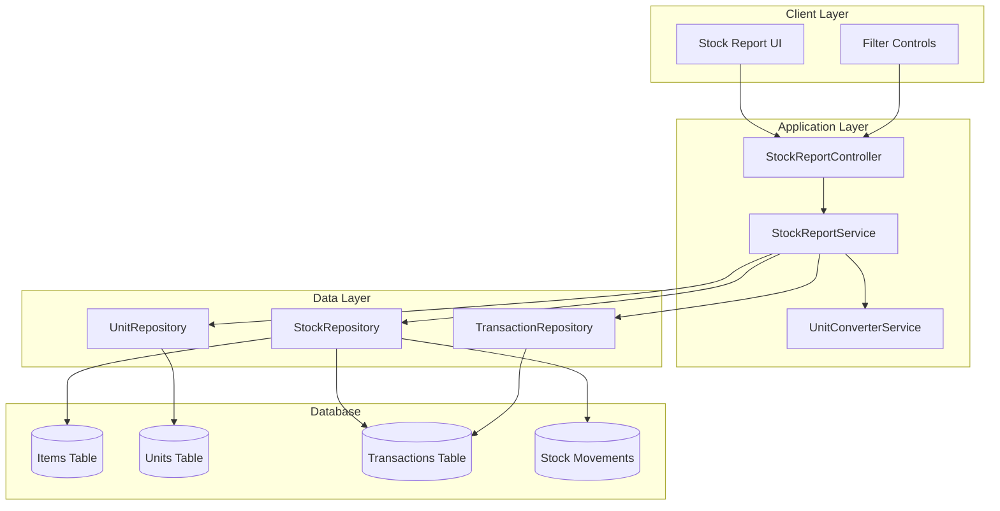

# Design Document: Stock Report System (Laporan Stok)

## Overview

The Stock Report System provides comprehensive stock tracking and reporting capabilities for materials, products, and supporting materials. The system displays detailed stock cards with transaction history, supports multi-unit conversions, and implements proper stock calculation logic for various transaction types.

### Key Features

- **Multi-Item Type Support**: Handles materials, products, and supporting materials
- **Unit Conversion System**: Displays stock data in different measurement units with proper conversion ratios
- **Stock Card Display**: Shows detailed transaction history with opening balances, purchases, production, and final stock
- **Role-Based Access**: Restricts access to admin and owner roles only
- **Date Range Filtering**: Supports filtering by date ranges with proper opening balance calculations
- **Performance Optimization**: Implements caching and query optimization for fast loading

### System Context

The Stock Report System integrates with the existing inventory management system, accessing transaction data from purchases, production activities, and stock adjustments. It provides read-only reporting functionality with no direct data modification capabilities.

## Architecture

### High-Level Architecture



### Component Responsibilities

- **StockReportController**: Handles HTTP requests, parameter validation, and response formatting
- **StockReportService**: Core business logic for stock calculations and data aggregation
- **UnitConverterService**: Manages unit conversions and ratio calculations
- **StockRepository**: Data access for stock-related queries
- **UnitRepository**: Manages unit definitions and conversion ratios
- **TransactionRepository**: Accesses transaction and stock movement data

## Components and Interfaces

### StockReportController

```typescript
interface StockReportController {
  getStockReport(params: StockReportParams): Promise<StockReportResponse>
  validateAccess(user: User): boolean
  validateParameters(params: StockReportParams): ValidationResult
}

interface StockReportParams {
  tipe?: 'material' | 'product' | 'bahan_pendukung'
  item_id?: number
  satuan_id?: number
  from_date?: Date
  to_date?: Date
}
```

### StockReportService

```typescript
interface StockReportService {
  generateStockReport(params: StockReportParams): Promise<StockCard[]>
  calculateOpeningBalance(itemId: number, unitId: number, beforeDate: Date): StockBalance
  processTransactions(transactions: Transaction[], unitId: number): StockMovement[]
  aggregateStockData(movements: StockMovement[]): StockCard[]
}

interface StockCard {
  date: Date
  reference: string
  openingBalance: StockEntry
  purchases: StockEntry
  production: StockEntry
  finalStock: StockEntry
}

interface StockEntry {
  quantity: number
  unitPrice: number
  totalValue: number
}
```

### UnitConverterService

```typescript
interface UnitConverterService {
  convertQuantity(quantity: number, fromUnitId: number, toUnitId: number): number
  getConversionRatio(fromUnitId: number, toUnitId: number): number
  convertPrice(price: number, fromUnitId: number, toUnitId: number): number
  getAvailableUnits(itemId: number): Unit[]
}

interface Unit {
  id: number
  name: string
  isPrimary: boolean
  conversionRatio: number
}
```

### Repository Interfaces

```typescript
interface StockRepository {
  getItemsByType(type: ItemType): Promise<Item[]>
  getStockMovements(itemId: number, dateRange?: DateRange): Promise<StockMovement[]>
  getInitialStock(itemId: number, beforeDate: Date): Promise<number>
}

interface TransactionRepository {
  getPurchaseTransactions(itemId: number, dateRange?: DateRange): Promise<Transaction[]>
  getProductionTransactions(itemId: number, dateRange?: DateRange): Promise<Transaction[]>
  getStockAdjustments(itemId: number, dateRange?: DateRange): Promise<Transaction[]>
}
```

## Data Models

### Core Entities

```typescript
interface Item {
  id: number
  name: string
  type: 'material' | 'product' | 'bahan_pendukung'
  primaryUnitId: number
  isActive: boolean
}

interface Transaction {
  id: number
  date: Date
  type: 'purchase' | 'production' | 'adjustment'
  itemId: number
  quantity: number
  unitId: number
  unitPrice: number
  reference: string
  description?: string
}

interface StockMovement {
  id: number
  transactionId: number
  itemId: number
  date: Date
  movementType: 'in' | 'out'
  quantity: number
  unitId: number
  unitPrice: number
  runningBalance: number
}
```

### Unit Conversion Model

```typescript
interface UnitConversion {
  id: number
  itemId: number
  unitId: number
  conversionRatio: number
  isActive: boolean
}

interface ConversionCache {
  fromUnitId: number
  toUnitId: number
  ratio: number
  lastUpdated: Date
}
```

### Stock Calculation Model

```typescript
interface StockCalculation {
  itemId: number
  unitId: number
  openingBalance: number
  totalPurchases: number
  totalProduction: number
  totalAdjustments: number
  finalStock: number
  calculationDate: Date
}

interface MonthlyBalance {
  year: number
  month: number
  itemId: number
  unitId: number
  openingBalance: number
  closingBalance: number
}
```

## Stock Calculation Logic

### Opening Balance Calculation

The system calculates opening balance by aggregating all stock movements before the specified date range:

```typescript
function calculateOpeningBalance(itemId: number, unitId: number, beforeDate: Date): number {
  const movements = getStockMovements(itemId, { to: beforeDate })
  let balance = 0
  
  for (const movement of movements) {
    const convertedQuantity = convertToUnit(movement.quantity, movement.unitId, unitId)
    balance += movement.movementType === 'in' ? convertedQuantity : -convertedQuantity
  }
  
  return balance
}
```

### Transaction Processing Rules

1. **Purchase Transactions**: Always increase stock levels (movement type: 'in')
2. **Production Transactions**: 
   - For products: Increase stock levels (movement type: 'in')
   - For materials: Decrease stock levels (movement type: 'out')
3. **Stock Adjustments**: Can be either 'in' or 'out' based on adjustment type

### Unit Conversion Formula

```typescript
function convertQuantity(quantity: number, fromUnitId: number, toUnitId: number): number {
  if (fromUnitId === toUnitId) return quantity
  
  const fromRatio = getConversionRatio(fromUnitId)
  const toRatio = getConversionRatio(toUnitId)
  
  // Convert to primary unit first, then to target unit
  const primaryQuantity = quantity / fromRatio
  return primaryQuantity * toRatio
}

function convertPrice(price: number, fromUnitId: number, toUnitId: number): number {
  const conversionRatio = getConversionRatio(fromUnitId) / getConversionRatio(toUnitId)
  return price / conversionRatio
}
```

### Running Balance Maintenance

The system maintains running balances for efficient stock card generation:

```typescript
function generateStockCard(movements: StockMovement[], unitId: number): StockCard[] {
  let runningBalance = 0
  const cards: StockCard[] = []
  
  for (const movement of movements) {
    const convertedQuantity = convertToUnit(movement.quantity, movement.unitId, unitId)
    const convertedPrice = convertPrice(movement.unitPrice, movement.unitId, unitId)
    
    runningBalance += movement.movementType === 'in' ? convertedQuantity : -convertedQuantity
    
    cards.push({
      date: movement.date,
      reference: movement.reference,
      openingBalance: { quantity: runningBalance - convertedQuantity, unitPrice: convertedPrice },
      purchases: movement.type === 'purchase' ? { quantity: convertedQuantity, unitPrice: convertedPrice } : null,
      production: movement.type === 'production' ? { quantity: convertedQuantity, unitPrice: convertedPrice } : null,
      finalStock: { quantity: runningBalance, unitPrice: convertedPrice }
    })
  }
  
  return cards
}
```

## Performance Optimization

### Caching Strategy

1. **Unit Conversion Cache**: Cache conversion ratios to avoid repeated database queries
2. **Monthly Balance Cache**: Pre-calculate monthly opening/closing balances for faster reporting
3. **Query Result Cache**: Cache frequently accessed stock data with appropriate TTL

### Database Optimization

```sql
-- Indexes for performance
CREATE INDEX idx_stock_movements_item_date ON stock_movements(item_id, date);
CREATE INDEX idx_transactions_item_type_date ON transactions(item_id, type, date);
CREATE INDEX idx_unit_conversions_item_unit ON unit_conversions(item_id, unit_id);

-- Materialized view for monthly balances
CREATE MATERIALIZED VIEW monthly_stock_balances AS
SELECT 
  item_id,
  unit_id,
  EXTRACT(YEAR FROM date) as year,
  EXTRACT(MONTH FROM date) as month,
  SUM(CASE WHEN movement_type = 'in' THEN quantity ELSE -quantity END) as net_movement
FROM stock_movements
GROUP BY item_id, unit_id, EXTRACT(YEAR FROM date), EXTRACT(MONTH FROM date);
```

### Query Optimization

- Use pagination for large datasets
- Implement lazy loading for stock card details
- Batch unit conversion calculations
- Use database-level aggregations where possible

## Security Considerations

### Access Control

```typescript
function validateAccess(user: User, action: string): boolean {
  const allowedRoles = ['admin', 'owner']
  return allowedRoles.includes(user.role)
}

function sanitizeParameters(params: StockReportParams): StockReportParams {
  return {
    tipe: sanitizeEnum(params.tipe, ['material', 'product', 'bahan_pendukung']),
    item_id: sanitizeInteger(params.item_id),
    satuan_id: sanitizeInteger(params.satuan_id),
    from_date: sanitizeDate(params.from_date),
    to_date: sanitizeDate(params.to_date)
  }
}
```

### Data Protection

- Validate all input parameters to prevent SQL injection
- Implement rate limiting for API endpoints
- Log all access attempts for audit purposes
- Ensure sensitive stock data is only accessible to authorized users

## User Interface Design

### Filter Controls

```typescript
interface FilterControls {
  itemTypeSelector: Dropdown<ItemType>
  itemSelector: Dropdown<Item>
  unitSelector: Dropdown<Unit>
  dateRangePicker: DateRangePicker
  generateButton: Button
}
```

### Stock Card Display

```typescript
interface StockCardTable {
  columns: ['Date', 'Reference', 'Opening Balance', 'Purchases', 'Production', 'Final Stock']
  rows: StockCardRow[]
  pagination: PaginationControls
  exportOptions: ExportControls
}

interface StockCardRow {
  date: string
  reference: string
  openingBalance: StockEntryDisplay
  purchases: StockEntryDisplay
  production: StockEntryDisplay
  finalStock: StockEntryDisplay
}

interface StockEntryDisplay {
  quantity: string
  unitPrice: string
  totalValue: string
  unit: string
}
```

### Responsive Design

- Mobile-first approach with horizontal scrolling for tables
- Collapsible filter sections on smaller screens
- Touch-friendly controls and adequate spacing
- Progressive disclosure of detailed information
## Correctness Properties

*A property is a characteristic or behavior that should hold true across all valid executions of a system-essentially, a formal statement about what the system should do. Properties serve as the bridge between human-readable specifications and machine-verifiable correctness guarantees.*

### Property 1: Access Control Enforcement

*For any* user attempting to access the stock report system, access should be granted if and only if the user has admin or owner role privileges.

**Validates: Requirements 1.1, 1.4**

### Property 2: Parameter Processing Consistency

*For any* valid combination of query parameters (tipe, item_id, satuan_id, from_date, to_date), the system should process them correctly and return appropriate stock data or error messages.

**Validates: Requirements 1.2, 8.1, 9.5**

### Property 3: Item Type Filtering Accuracy

*For any* item type selection and corresponding item filtering, the system should display only items that match the selected type and properly filter stock data accordingly.

**Validates: Requirements 2.2, 2.3**

### Property 4: Unit Conversion Mathematical Consistency

*For any* quantity and unit conversion operation, the conversion should follow the formula display_quantity = primary_quantity × conversion_ratio and maintain mathematical consistency across all calculations.

**Validates: Requirements 3.3, 3.4, 3.6, 5.6, 7.1**

### Property 5: Unit Display Constraints

*For any* item with configured units, the system should display at most 4 units (1 primary + 3 sub-units) and show conversion ratio information for non-primary units.

**Validates: Requirements 3.2, 3.5**

### Property 6: Transaction Processing Rules

*For any* transaction, the system should apply the correct stock movement rule: purchases increase stock, production increases stock for products but decreases stock for materials.

**Validates: Requirements 5.2, 5.3, 5.4**

### Property 7: Stock Calculation Accuracy

*For any* set of transactions and date range, the opening balance calculation should include all transactions before the date range, and running totals should accurately reflect cumulative stock changes.

**Validates: Requirements 5.1, 5.5, 5.7**

### Property 8: Transaction Display Consistency

*For any* transaction set, each transaction should appear as a separate row with individual dates, and transaction references should include both type and ID information.

**Validates: Requirements 4.2, 4.4**

### Property 9: Data Formatting Consistency

*For any* displayed values, monetary amounts should use proper currency formatting, quantities should have appropriate decimal precision, and totals should equal quantity × unit_price.

**Validates: Requirements 4.5, 4.6, 7.3, 7.5**

### Property 10: Multi-Unit Data Consistency

*For any* item displayed in different units, the transaction dates, references, and underlying data should remain identical across all unit representations, with only quantities and prices converted appropriately.

**Validates: Requirements 6.1, 6.4, 6.5, 7.2, 7.4**

### Property 11: Date Range Filtering Accuracy

*For any* specified date range, the system should display only transactions within that range and calculate opening balances from all transactions before the range start date.

**Validates: Requirements 8.2, 8.4**

### Property 12: Monthly Balance Display

*For any* date range spanning multiple months, the system should display monthly opening balance rows appropriately.

**Validates: Requirements 4.3, 8.5**

### Property 13: Unit Parameter Handling

*For any* satuan_id parameter value, the system should display data in the specified unit if valid, or fall back to the primary unit if invalid.

**Validates: Requirements 6.2, 9.2**

### Property 14: Error Handling Robustness

*For any* invalid input or system error condition, the system should display appropriate error messages, log errors when necessary, and handle graceful fallbacks.

**Validates: Requirements 9.1, 9.3, 9.4**

## Error Handling

### Input Validation Strategy

```typescript
interface ValidationRules {
  validateItemType(type: string): boolean
  validateItemId(id: number): Promise<boolean>
  validateUnitId(unitId: number, itemId: number): Promise<boolean>
  validateDateRange(from: Date, to: Date): boolean
  validateUserAccess(user: User): boolean
}

function validateStockReportRequest(params: StockReportParams, user: User): ValidationResult {
  const errors: string[] = []
  
  if (!validateUserAccess(user)) {
    errors.push('Insufficient permissions to access stock reports')
  }
  
  if (params.tipe && !validateItemType(params.tipe)) {
    errors.push('Invalid item type specified')
  }
  
  if (params.item_id && !await validateItemId(params.item_id)) {
    errors.push('Invalid item ID specified')
  }
  
  if (params.satuan_id && params.item_id && !await validateUnitId(params.satuan_id, params.item_id)) {
    // Don't error, fall back to primary unit
    params.satuan_id = null
  }
  
  if (params.from_date && params.to_date && !validateDateRange(params.from_date, params.to_date)) {
    errors.push('Invalid date range specified')
  }
  
  return { isValid: errors.length === 0, errors }
}
```

### Error Response Handling

```typescript
interface ErrorResponse {
  success: false
  message: string
  code: string
  details?: any
}

function handleStockReportError(error: Error): ErrorResponse {
  if (error instanceof ValidationError) {
    return {
      success: false,
      message: error.message,
      code: 'VALIDATION_ERROR'
    }
  }
  
  if (error instanceof DatabaseError) {
    logger.error('Database error in stock report', error)
    return {
      success: false,
      message: 'Unable to retrieve stock data. Please try again later.',
      code: 'DATABASE_ERROR'
    }
  }
  
  logger.error('Unexpected error in stock report', error)
  return {
    success: false,
    message: 'An unexpected error occurred. Please contact support.',
    code: 'INTERNAL_ERROR'
  }
}
```

### Fallback Mechanisms

1. **Invalid Unit Fallback**: When invalid satuan_id is provided, fall back to primary unit
2. **No Data Handling**: Display "No stock data available" message when no transactions exist
3. **Partial Data Display**: Show available data even if some calculations fail
4. **Graceful Degradation**: Provide basic functionality even if advanced features fail

## Testing Strategy

### Dual Testing Approach

The Stock Report System requires comprehensive testing using both unit tests and property-based tests to ensure correctness and reliability.

**Unit Testing Focus:**
- Specific examples of stock calculations with known inputs and outputs
- Edge cases like empty stock data, single transactions, and boundary dates
- Error conditions and fallback behaviors
- Integration points between components
- UI component rendering and interaction

**Property-Based Testing Focus:**
- Universal properties that must hold across all valid inputs
- Mathematical consistency of unit conversions and stock calculations
- Data integrity across different unit representations
- Comprehensive input coverage through randomization

### Property-Based Testing Configuration

**Testing Framework**: Use QuickCheck-style property testing library appropriate for the target language (e.g., fast-check for JavaScript/TypeScript, Hypothesis for Python, QuickCheck for Haskell)

**Test Configuration:**
- Minimum 100 iterations per property test to ensure comprehensive coverage
- Custom generators for realistic test data (items, transactions, units, dates)
- Shrinking capabilities to find minimal failing examples
- Deterministic seeding for reproducible test runs

**Property Test Implementation Requirements:**
- Each correctness property must be implemented as a single property-based test
- Tests must reference their corresponding design document property
- Tag format: **Feature: laporan-stok, Property {number}: {property_text}**
- Generate realistic test data that reflects actual system usage patterns

### Test Data Generation Strategy

```typescript
// Example generators for property-based testing
interface TestGenerators {
  generateUser(): User
  generateItem(type?: ItemType): Item
  generateTransaction(itemId: number): Transaction
  generateUnitConversion(itemId: number): UnitConversion
  generateDateRange(): { from: Date, to: Date }
  generateStockReportParams(): StockReportParams
}

// Property test example
test('Property 4: Unit Conversion Mathematical Consistency', () => {
  fc.assert(fc.property(
    fc.record({
      quantity: fc.float({ min: 0.01, max: 10000 }),
      fromUnit: generateUnit(),
      toUnit: generateUnit(),
      conversionRatio: fc.float({ min: 0.001, max: 1000 })
    }),
    ({ quantity, fromUnit, toUnit, conversionRatio }) => {
      const converted = convertQuantity(quantity, fromUnit.id, toUnit.id)
      const expectedResult = quantity * conversionRatio
      
      // Allow for floating point precision tolerance
      return Math.abs(converted - expectedResult) < 0.0001
    }
  ), { numRuns: 100 })
})
```

### Integration Testing

- Test complete stock report generation workflows
- Verify database query performance with realistic data volumes
- Test concurrent access scenarios
- Validate caching behavior and cache invalidation
- Test API endpoint responses and error handling

### Performance Testing

- Load testing with large datasets (10,000+ transactions)
- Stress testing concurrent user access
- Memory usage profiling for large stock calculations
- Database query performance optimization validation
- Cache effectiveness measurement

### Security Testing

- Access control validation across different user roles
- Input sanitization and SQL injection prevention
- Rate limiting and abuse prevention
- Audit logging verification
- Data privacy and sensitive information protection