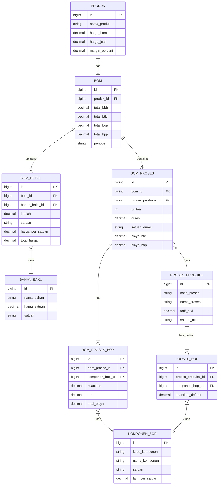

# Design Document: Process Costing HPP System

## Overview

Sistem ini mengimplementasikan metode Process Costing untuk menghitung Harga Pokok Produksi (HPP) yang sesuai dengan standar akuntansi biaya. Sistem menggantikan perhitungan persentase sederhana (BTKL 60%, BOP 40%) dengan perhitungan berbasis proses produksi yang lebih akurat.

### Komponen Biaya HPP:
1. **BBB (Biaya Bahan Baku)** - Biaya langsung dari bahan baku yang digunakan
2. **BTKL (Biaya Tenaga Kerja Langsung)** - Biaya per proses produksi berdasarkan durasi/kuantitas
3. **BOP (Biaya Overhead Pabrik)** - Biaya tidak langsung per proses (listrik, gas, penyusutan, dll)

### Formula HPP:
```
HPP = Total BBB + Total BTKL + Total BOP

Dimana:
- Total BBB = Σ (Qty Bahan × Harga Satuan Bahan)
- Total BTKL = Σ (Durasi Proses × Tarif BTKL Proses)
- Total BOP = Σ (Durasi Proses × Tarif BOP Proses)
```

## Architecture

```
┌─────────────────────────────────────────────────────────────────┐
│                        BOM (Bill of Materials)                   │
├─────────────────────────────────────────────────────────────────┤
│  ┌─────────────┐  ┌─────────────┐  ┌─────────────────────────┐  │
│  │    BBB      │  │    BTKL     │  │         BOP             │  │
│  │ (Bahan Baku)│  │(Tenaga Kerja)│ │   (Overhead Pabrik)     │  │
│  └──────┬──────┘  └──────┬──────┘  └───────────┬─────────────┘  │
│         │                │                     │                 │
│         ▼                ▼                     ▼                 │
│  ┌─────────────┐  ┌─────────────┐  ┌─────────────────────────┐  │
│  │ BOM Details │  │ BOM Proses  │  │    BOM Proses BOP       │  │
│  │ (bahan_baku)│  │  (proses +  │  │  (komponen overhead)    │  │
│  │             │  │  BTKL rate) │  │                         │  │
│  └─────────────┘  └─────────────┘  └─────────────────────────┘  │
└─────────────────────────────────────────────────────────────────┘
                              │
                              ▼
                    ┌─────────────────┐
                    │   HPP Produk    │
                    │ (harga_bom)     │
                    └─────────────────┘
```

## Components and Interfaces

### 1. Master Data Proses Produksi

**Model: ProsesProduksi**
```php
class ProsesProduksi extends Model
{
    protected $table = 'proses_produksis';
    protected $fillable = [
        'kode_proses',      // Kode unik proses (PRO-001)
        'nama_proses',      // Nama proses (Menggoreng, Membumbui, Mengemas)
        'deskripsi',        // Deskripsi proses
        'tarif_btkl',       // Tarif BTKL per satuan waktu (Rp/jam atau Rp/unit)
        'satuan_btkl',      // Satuan waktu (jam, menit, unit)
        'is_active'         // Status aktif
    ];
}
```

### 2. Master Data Komponen BOP

**Model: KomponenBop**
```php
class KomponenBop extends Model
{
    protected $table = 'komponen_bops';
    protected $fillable = [
        'kode_komponen',    // Kode unik (BOP-001)
        'nama_komponen',    // Nama (Listrik, Gas, Penyusutan Mesin)
        'satuan',           // Satuan (kWh, m³, jam)
        'tarif_per_satuan', // Tarif per satuan
        'is_active'
    ];
}
```

### 3. Relasi Proses-BOP

**Model: ProsesBop**
```php
class ProsesBop extends Model
{
    protected $table = 'proses_bops';
    protected $fillable = [
        'proses_produksi_id',
        'komponen_bop_id',
        'kuantitas_default',  // Kuantitas default per proses
        'tarif_total'         // Calculated: kuantitas × tarif komponen
    ];
}
```

### 4. BOM dengan Process Costing

**Model: BomProses**
```php
class BomProses extends Model
{
    protected $table = 'bom_proses';
    protected $fillable = [
        'bom_id',
        'proses_produksi_id',
        'urutan',             // Urutan proses (1, 2, 3...)
        'durasi',             // Durasi/kuantitas proses
        'satuan_durasi',      // Satuan (jam, menit, unit)
        'biaya_btkl',         // Calculated: durasi × tarif_btkl
        'biaya_bop',          // Calculated: sum of BOP components
        'catatan'
    ];
}
```

**Model: BomProsesBop**
```php
class BomProsesBop extends Model
{
    protected $table = 'bom_proses_bops';
    protected $fillable = [
        'bom_proses_id',
        'komponen_bop_id',
        'kuantitas',
        'tarif',
        'total_biaya'         // Calculated: kuantitas × tarif
    ];
}
```

### 5. Service Layer

**BomCalculationService (Enhanced)**
```php
class BomCalculationService
{
    public function calculateHPP(Bom $bom): array
    {
        $totalBBB = $this->calculateTotalBBB($bom);
        $totalBTKL = $this->calculateTotalBTKL($bom);
        $totalBOP = $this->calculateTotalBOP($bom);
        
        return [
            'total_bbb' => $totalBBB,
            'total_btkl' => $totalBTKL,
            'total_bop' => $totalBOP,
            'hpp' => $totalBBB + $totalBTKL + $totalBOP,
            'breakdown' => [
                'bahan_baku' => $this->getBBBBreakdown($bom),
                'proses' => $this->getProsesBreakdown($bom)
            ]
        ];
    }
    
    private function calculateTotalBBB(Bom $bom): float
    {
        return $bom->details->sum('total_harga');
    }
    
    private function calculateTotalBTKL(Bom $bom): float
    {
        return $bom->proses->sum('biaya_btkl');
    }
    
    private function calculateTotalBOP(Bom $bom): float
    {
        return $bom->proses->sum('biaya_bop');
    }
}
```

## Data Models

### ERD (Entity Relationship Diagram)



### Database Schema

```sql
-- Tabel Master Proses Produksi
CREATE TABLE proses_produksis (
    id BIGINT UNSIGNED AUTO_INCREMENT PRIMARY KEY,
    kode_proses VARCHAR(20) UNIQUE NOT NULL,
    nama_proses VARCHAR(100) NOT NULL,
    deskripsi TEXT NULL,
    tarif_btkl DECIMAL(15,2) DEFAULT 0,
    satuan_btkl VARCHAR(20) DEFAULT 'jam',
    is_active BOOLEAN DEFAULT TRUE,
    created_at TIMESTAMP NULL,
    updated_at TIMESTAMP NULL
);

-- Tabel Master Komponen BOP
CREATE TABLE komponen_bops (
    id BIGINT UNSIGNED AUTO_INCREMENT PRIMARY KEY,
    kode_komponen VARCHAR(20) UNIQUE NOT NULL,
    nama_komponen VARCHAR(100) NOT NULL,
    satuan VARCHAR(20) NOT NULL,
    tarif_per_satuan DECIMAL(15,2) DEFAULT 0,
    is_active BOOLEAN DEFAULT TRUE,
    created_at TIMESTAMP NULL,
    updated_at TIMESTAMP NULL
);

-- Tabel Relasi Proses-BOP (Default BOP per Proses)
CREATE TABLE proses_bops (
    id BIGINT UNSIGNED AUTO_INCREMENT PRIMARY KEY,
    proses_produksi_id BIGINT UNSIGNED NOT NULL,
    komponen_bop_id BIGINT UNSIGNED NOT NULL,
    kuantitas_default DECIMAL(15,4) DEFAULT 0,
    created_at TIMESTAMP NULL,
    updated_at TIMESTAMP NULL,
    FOREIGN KEY (proses_produksi_id) REFERENCES proses_produksis(id) ON DELETE CASCADE,
    FOREIGN KEY (komponen_bop_id) REFERENCES komponen_bops(id) ON DELETE CASCADE
);

-- Tabel BOM Proses (Proses dalam BOM)
CREATE TABLE bom_proses (
    id BIGINT UNSIGNED AUTO_INCREMENT PRIMARY KEY,
    bom_id BIGINT UNSIGNED NOT NULL,
    proses_produksi_id BIGINT UNSIGNED NOT NULL,
    urutan INT DEFAULT 1,
    durasi DECIMAL(15,4) DEFAULT 0,
    satuan_durasi VARCHAR(20) DEFAULT 'jam',
    biaya_btkl DECIMAL(15,2) DEFAULT 0,
    biaya_bop DECIMAL(15,2) DEFAULT 0,
    catatan TEXT NULL,
    created_at TIMESTAMP NULL,
    updated_at TIMESTAMP NULL,
    FOREIGN KEY (bom_id) REFERENCES boms(id) ON DELETE CASCADE,
    FOREIGN KEY (proses_produksi_id) REFERENCES proses_produksis(id) ON DELETE RESTRICT
);

-- Tabel BOM Proses BOP (Detail BOP per Proses dalam BOM)
CREATE TABLE bom_proses_bops (
    id BIGINT UNSIGNED AUTO_INCREMENT PRIMARY KEY,
    bom_proses_id BIGINT UNSIGNED NOT NULL,
    komponen_bop_id BIGINT UNSIGNED NOT NULL,
    kuantitas DECIMAL(15,4) DEFAULT 0,
    tarif DECIMAL(15,2) DEFAULT 0,
    total_biaya DECIMAL(15,2) DEFAULT 0,
    created_at TIMESTAMP NULL,
    updated_at TIMESTAMP NULL,
    FOREIGN KEY (bom_proses_id) REFERENCES bom_proses(id) ON DELETE CASCADE,
    FOREIGN KEY (komponen_bop_id) REFERENCES komponen_bops(id) ON DELETE RESTRICT
);

-- Modifikasi tabel boms untuk menyimpan total per komponen
ALTER TABLE boms ADD COLUMN total_bbb DECIMAL(15,2) DEFAULT 0 AFTER total_biaya;
ALTER TABLE boms ADD COLUMN total_hpp DECIMAL(15,2) DEFAULT 0 AFTER total_bop;
```

## Correctness Properties

*A property is a characteristic or behavior that should hold true across all valid executions of a system-essentially, a formal statement about what the system should do. Properties serve as the bridge between human-readable specifications and machine-verifiable correctness guarantees.*

### Property 1: HPP Calculation Formula
*For any* BOM with raw materials and production processes, the HPP SHALL equal the sum of Total BBB + Total BTKL + Total BOP.
**Validates: Requirements 3.4**

### Property 2: BTKL Calculation per Process
*For any* production process with duration D and BTKL rate R, the BTKL cost SHALL equal D × R.
**Validates: Requirements 3.3**

### Property 3: BOP Calculation per Process
*For any* production process with BOP components, the total BOP SHALL equal the sum of (component quantity × component rate) for all components.
**Validates: Requirements 2.2, 3.3**

### Property 4: Cascade Recalculation on Rate Change
*For any* change in material price, BTKL rate, or BOP rate, all affected BOMs SHALL be recalculated with the new values.
**Validates: Requirements 4.1, 4.2, 4.3**

### Property 5: Process Deletion Constraint
*For any* production process that is referenced by at least one BOM, deletion SHALL be prevented.
**Validates: Requirements 1.4**

### Property 6: Variance Calculation
*For any* completed production order, the variance SHALL equal (Actual HPP - Standard HPP) and variance percentage SHALL equal (Variance / Standard HPP) × 100.
**Validates: Requirements 6.4, 6.5**

### Property 7: BBB Total Calculation
*For any* BOM with N raw materials, Total BBB SHALL equal the sum of (quantity × unit price) for all materials.
**Validates: Requirements 3.1**

### Property 8: Product HPP Update
*For any* saved BOM, the associated product's harga_bom SHALL equal the calculated HPP.
**Validates: Requirements 3.5**

## Error Handling

1. **Validation Errors**
   - Empty required fields → Display field-specific error message
   - Invalid numeric values → Display "Nilai harus berupa angka positif"
   - Duplicate process codes → Display "Kode proses sudah digunakan"

2. **Business Logic Errors**
   - Delete process with BOM reference → Display "Proses tidak dapat dihapus karena digunakan dalam BOM"
   - Material without price → Display "Bahan baku belum memiliki harga"
   - Zero duration → Display "Durasi proses tidak boleh nol"

3. **System Errors**
   - Database connection failure → Log error, display generic message
   - Calculation overflow → Use BigDecimal, log warning

## Testing Strategy

### Unit Testing
- Test individual calculation methods in BomCalculationService
- Test model relationships and accessors
- Test validation rules

### Property-Based Testing
Using **Pest PHP** with **pest-plugin-faker** for property-based testing:

1. **HPP Formula Property Test**
   - Generate random BBB, BTKL, BOP values
   - Verify HPP = BBB + BTKL + BOP
   - Tag: **Feature: process-costing-hpp, Property 1: HPP Calculation Formula**

2. **BTKL Calculation Property Test**
   - Generate random duration and rate
   - Verify BTKL = duration × rate
   - Tag: **Feature: process-costing-hpp, Property 2: BTKL Calculation per Process**

3. **BOP Calculation Property Test**
   - Generate random BOP components with quantities and rates
   - Verify total BOP = sum of (qty × rate)
   - Tag: **Feature: process-costing-hpp, Property 3: BOP Calculation per Process**

4. **Cascade Recalculation Property Test**
   - Create BOM, change rate, verify recalculation
   - Tag: **Feature: process-costing-hpp, Property 4: Cascade Recalculation on Rate Change**

5. **Deletion Constraint Property Test**
   - Create process with BOM reference, attempt delete
   - Verify deletion is blocked
   - Tag: **Feature: process-costing-hpp, Property 5: Process Deletion Constraint**

6. **Variance Calculation Property Test**
   - Generate random actual and standard costs
   - Verify variance formula
   - Tag: **Feature: process-costing-hpp, Property 6: Variance Calculation**

### Integration Testing
- Test complete BOM creation flow with processes
- Test HPP recalculation when rates change
- Test report generation with filters
