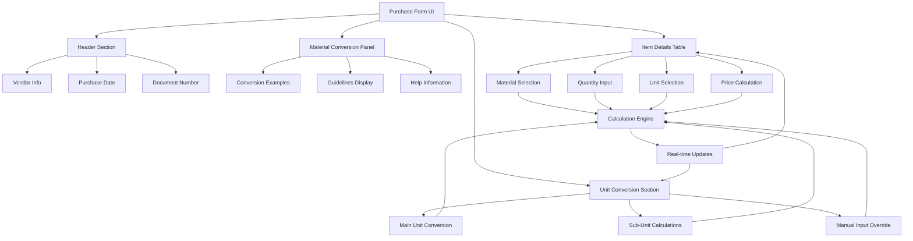
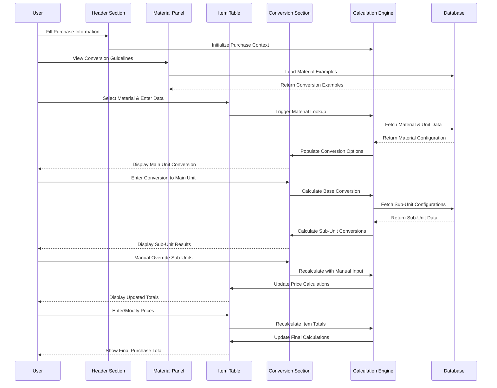

# Design Document: Purchase Form Calculations Enhancement

## Overview

This design addresses critical calculation issues in the purchase form at `/transaksi/pembelian/create`. The current system has broken total price calculations, non-functional unit conversions, and missing sub-unit calculation capabilities. The enhanced system will provide real-time calculations, flexible unit conversions, and comprehensive sub-unit handling for both raw materials (bahan baku) and supporting materials (bahan pendukung).

The solution implements a reactive calculation engine with automatic price computation, intelligent unit conversion with manual override capabilities, and a flexible sub-unit system that adapts to different material types and purchase scenarios.

## Architecture



## Main Algorithm/Workflow



## Components and Interfaces

### Component 1: Header Section

**Purpose**: Displays purchase document information and metadata

**Interface**:
```php
interface HeaderSectionInterface {
    public function renderVendorSelection(): string;
    public function renderPurchaseDate(): string;
    public function renderDocumentNumber(): string;
    public function renderPurchaseType(): string;
    public function validateHeaderData(array $headerData): ValidationResult;
}
```

**Responsibilities**:
- Display vendor selection dropdown with search capability
- Handle purchase date input with date picker
- Generate and display document numbers
- Manage purchase type selection (bahan baku/pendukung)
- Validate header information completeness

### Component 2: Material Conversion Information Panel

**Purpose**: Provides conversion examples and guidelines to help users understand the conversion system

**Interface**:
```php
interface MaterialConversionPanelInterface {
    public function renderConversionExamples(): string;
    public function renderGuidelines(): string;
    public function getExamplesByMaterialType(string $materialType): array;
    public function renderHelpTooltips(): string;
    public function updateExamplesForMaterial(int $materialId): string;
}
```

**Responsibilities**:
- Display conversion examples from master data
- Show step-by-step conversion guidelines
- Provide contextual help and tooltips
- Update examples based on selected material type
- Render conversion formula explanations

### Component 3: Item Details Table

**Purpose**: Main data entry table for purchase items with integrated calculations

**Interface**:
```php
interface ItemDetailsTableInterface {
    public function renderMaterialNameColumn(): string;
    public function renderQuantityColumn(): string;
    public function renderPurchaseUnitColumn(): string;
    public function renderUnitPriceColumn(): string;
    public function renderTotalPriceColumn(): string;
    public function addNewRow(): string;
    public function removeRow(int $rowIndex): bool;
    public function calculateRowTotal(int $rowIndex): float;
    public function validateRowData(int $rowIndex): ValidationResult;
}
```

**Responsibilities**:
- Render material selection with autocomplete search
- Handle quantity input with real-time validation
- Manage purchase unit dropdown based on material
- Calculate and display unit prices and totals
- Support dynamic row addition and removal
- Integrate with calculation engine for real-time updates

### Component 4: Unit Conversion Section

**Purpose**: Handles main unit conversion and sub-unit calculations with manual override capabilities

**Interface**:
```php
interface UnitConversionSectionInterface {
    public function renderMainUnitConversion(): string;
    public function renderSubUnitCalculations(): string;
    public function handleManualConversionInput(float $manualValue): ConversionResult;
    public function updateSubUnitCalculations(float $baseQuantity): array;
    public function renderConversionFormulas(): string;
    public function validateConversionInputs(): ValidationResult;
}
```

**Responsibilities**:
- Display main unit conversion input with manual override
- Calculate and show sub-unit conversions from master data
- Handle manual sub-unit quantity adjustments
- Generate and display conversion formulas
- Validate all conversion inputs and calculations
- Provide real-time formula updates

### Component 5: Calculation Engine (Updated)

**Purpose**: Core calculation logic coordinating all form sections

**Interface**:
```php
interface CalculationEngineInterface {
    public function initializePurchaseContext(array $headerData): PurchaseContext;
    public function processItemCalculation(ItemData $item): ItemCalculationResult;
    public function processUnitConversion(ConversionRequest $request): ConversionResult;
    public function processSubUnitCalculations(float $baseQuantity, array $subUnitConfigs): array;
    public function calculateFormTotals(array $items): FormTotalResult;
    public function validateAllCalculations(PurchaseFormData $formData): ValidationResult;
    public function generateCalculationSummary(): CalculationSummary;
}
```

**Responsibilities**:
- Coordinate calculations across all form sections
- Maintain calculation state and context
- Process real-time updates from any form section
- Validate calculation consistency across sections
- Generate comprehensive calculation summaries
- Handle error propagation and recovery

### Component 6: Price Calculator (Updated)

**Purpose**: Handles all price-related calculations with integration to table display

**Interface**:
```php
interface PriceCalculatorInterface {
    public function calculateItemTotal(float $quantity, float $unitPrice): float;
    public function calculateSubtotal(array $itemTotals): float;
    public function calculateFinalTotal(float $subtotal, float $shipping, float $tax): float;
    public function calculatePerUnitFromTotal(float $totalPrice, float $quantity): float;
    public function calculateTotalFromPerUnit(float $unitPrice, float $quantity): float;
    public function formatCurrency(float $amount): string;
    public function updateTableTotals(array $tableData): array;
    public function validatePriceInputs(array $priceData): ValidationResult;
}
```

**Responsibilities**:
- Calculate individual item totals for table display
- Compute subtotals and final totals with real-time updates
- Handle bidirectional price calculations (total ↔ per-unit)
- Apply tax and shipping calculations
- Format monetary values for consistent display
- Integrate with item details table for seamless updates

### Component 7: Unit Converter (Updated)

**Purpose**: Manages unit conversions with enhanced UI integration and manual override capability

**Interface**:
```php
interface UnitConverterInterface {
    public function getConversionRate(string $fromUnit, string $toUnit): ?float;
    public function convertToBaseUnit(float $quantity, string $purchaseUnit, string $baseUnit, ?float $manualRate = null): ConversionResult;
    public function validateConversion(float $quantity, string $fromUnit, string $toUnit, float $rate): bool;
    public function getAvailableUnits(): array;
    public function getSupportedConversions(string $unit): array;
    public function renderConversionUI(int $materialId): string;
    public function updateConversionDisplay(ConversionResult $result): string;
}
```

**Responsibilities**:
- Retrieve conversion rates from database or predefined rules
- Convert quantities from purchase units to base units
- Support manual conversion rate override with UI feedback
- Validate conversion inputs and rates
- Provide available unit options for dropdowns
- Render conversion section UI components
- Update conversion displays in real-time

### Component 8: Sub-Unit Manager (Updated)

**Purpose**: Handles sub-unit calculations with enhanced display and manual input capabilities

**Interface**:
```php
interface SubUnitManagerInterface {
    public function getSubUnits(int $materialId, string $materialType): array;
    public function calculateSubUnitQuantities(float $baseQuantity, array $subUnitConfigs): array;
    public function updateSubUnitQuantity(int $subUnitId, float $newQuantity, float $baseQuantity): SubUnitResult;
    public function generateConversionFormula(float $baseQuantity, float $conversionFactor, string $subUnitName): string;
    public function validateSubUnitInput(float $quantity, float $conversionFactor): bool;
    public function renderSubUnitSection(array $subUnits): string;
    public function handleManualSubUnitInput(int $subUnitId, float $manualQuantity): SubUnitUpdateResult;
}
```

**Responsibilities**:
- Fetch sub-unit configurations from material master data
- Calculate sub-unit quantities based on base unit amounts
- Handle manual sub-unit quantity adjustments with real-time updates
- Generate and display conversion formulas dynamically
- Validate sub-unit calculations and manual inputs
- Render sub-unit conversion section UI
- Process manual sub-unit input changes

## Data Models

### Model 1: PurchaseFormData

```php
interface PurchaseFormData {
    public HeaderData $header;
    public array $items; // Array of ItemData
    public array $conversions; // Array of ConversionData
    public FormTotals $totals;
    public ValidationState $validation;
}
```

**Validation Rules**:
- header must contain valid vendor, date, and document information
- items array must contain at least one valid item
- conversions must match items array length
- totals must be consistent with item calculations

### Model 2: HeaderData

```php
interface HeaderData {
    public int $vendorId;
    public string $vendorName;
    public string $purchaseDate;
    public string $documentNumber;
    public string $purchaseType; // 'bahan_baku' or 'bahan_pendukung'
    public ?string $notes;
    public ?float $shippingCost;
    public ?float $taxPercent;
}
```

**Validation Rules**:
- vendorId must exist in vendor table
- purchaseDate must be valid date format
- documentNumber must be unique
- purchaseType must be valid enum value
- shippingCost and taxPercent must be non-negative if provided

### Model 3: ItemData

```php
interface ItemData {
    public int $materialId;
    public string $materialName;
    public float $quantity;
    public string $purchaseUnit;
    public string $baseUnit;
    public ?float $unitPrice;
    public ?float $totalPrice;
    public ConversionData $conversion;
    public array $subUnits; // Array of SubUnitData
}
```

**Validation Rules**:
- materialId must exist in respective material table
- quantity must be positive number
- purchaseUnit and baseUnit must be valid unit names
- Either unitPrice or totalPrice must be provided
- conversion must be valid ConversionData object

### Model 4: ConversionData

```php
interface ConversionData {
    public float $purchaseQuantity;
    public string $purchaseUnit;
    public float $baseQuantity;
    public string $baseUnit;
    public float $conversionRate;
    public bool $isManualRate;
    public string $conversionFormula;
    public bool $isValid;
    public ?string $errorMessage;
}
```

**Validation Rules**:
- All quantities must be non-negative
- Conversion rate must be positive
- Formula must be properly formatted string
- Error message required when isValid is false

### Model 5: SubUnitData

```php
interface SubUnitData {
    public int $subUnitId;
    public string $subUnitName;
    public float $baseQuantity;
    public float $conversionFactor;
    public float $calculatedQuantity;
    public ?float $manualQuantity;
    public string $conversionFormula;
    public bool $isManualOverride;
    public bool $isValid;
}
```

**Validation Rules**:
- subUnitId must exist in satuan table
- conversionFactor must be positive
- calculatedQuantity must match formula result
- manualQuantity must be non-negative if provided
- formula must accurately represent the calculation

### Model 6: FormTotals

```php
interface FormTotals {
    public float $subtotal;
    public float $shippingCost;
    public float $taxAmount;
    public float $finalTotal;
    public array $itemTotals; // Array of individual item totals
    public bool $isCalculated;
    public string $lastUpdated;
}
```

**Validation Rules**:
- All monetary values must be non-negative
- subtotal must equal sum of itemTotals
- finalTotal must equal subtotal + shipping + tax
- lastUpdated must be valid timestamp

## Algorithmic Pseudocode

### Main Processing Algorithm

```pascal
ALGORITHM processFormCalculations(input)
INPUT: input of type CalculationRequest
OUTPUT: result of type CalculationResult

BEGIN
  ASSERT validateInput(input) = true
  
  // Step 1: Initialize calculation state
  state ← initializeCalculationState(input)
  
  // Step 2: Process unit conversion with loop invariant
  FOR each item IN input.items DO
    ASSERT allProcessedItemsValid(state.processedItems)
    
    conversionResult ← calculateUnitConversion(item)
    IF conversionResult.isValid THEN
      state.conversions.add(conversionResult)
    ELSE
      RETURN createErrorResult(conversionResult.errorMessage)
    END IF
  END FOR
  
  // Step 3: Calculate prices
  priceResult ← calculatePrices(state.conversions, input.prices)
  ASSERT priceResult.isValid() AND priceResult.isComplete()
  
  // Step 4: Process sub-units
  subUnitResults ← calculateSubUnits(state.conversions, input.subUnitConfigs)
  
  // Step 5: Finalize calculations
  finalResult ← finalizeCalculations(priceResult, subUnitResults)
  
  ASSERT finalResult.isComplete() AND finalResult.isValid()
  
  RETURN finalResult
END
```

**Preconditions:**
- input is validated and well-formed
- input.items is a valid collection
- All required calculation functions are available

**Postconditions:**
- result is complete and valid
- All input items have been processed
- Calculation state is properly finalized

**Loop Invariants:**
- All processed items are valid
- Calculation state remains consistent throughout iteration

### Unit Conversion Algorithm

```pascal
ALGORITHM calculateUnitConversion(quantity, fromUnit, toUnit, manualRate)
INPUT: quantity of type float, fromUnit of type string, toUnit of type string, manualRate of type optional float
OUTPUT: conversionResult of type ConversionResult

BEGIN
  // Check basic structure
  IF quantity <= 0 OR fromUnit = null OR toUnit = null THEN
    RETURN createErrorResult("Invalid conversion parameters")
  END IF
  
  // Determine conversion rate
  IF manualRate IS PROVIDED AND manualRate > 0 THEN
    rate ← manualRate
    isManual ← true
  ELSE
    rate ← getConversionRate(fromUnit, toUnit)
    isManual ← false
    IF rate = null OR rate <= 0 THEN
      RETURN createErrorResult("No conversion rate available")
    END IF
  END IF
  
  // Perform conversion
  convertedQuantity ← quantity * rate
  formula ← generateFormula(quantity, fromUnit, rate, convertedQuantity, toUnit)
  
  // Create result
  result ← ConversionResult{
    originalQuantity: quantity,
    originalUnit: fromUnit,
    convertedQuantity: convertedQuantity,
    convertedUnit: toUnit,
    conversionRate: rate,
    isManualRate: isManual,
    formula: formula,
    isValid: true,
    errorMessage: null
  }
  
  RETURN result
END
```

**Preconditions:**
- quantity parameter is provided (may be zero or negative, but parameter exists)
- fromUnit and toUnit are valid unit strings
- getConversionRate function is available and properly implemented

**Postconditions:**
- Returns ConversionResult with valid conversion data
- If successful: result.isValid = true and convertedQuantity > 0
- If error: result.isValid = false and errorMessage contains description
- No side effects on input parameters

**Loop Invariants:**
- N/A (no loops in this algorithm)

### Price Calculation Algorithm

```pascal
ALGORITHM calculatePrices(items, priceInputs)
INPUT: items of type array of ConversionResult, priceInputs of type PriceInputs
OUTPUT: priceResult of type PriceResult

BEGIN
  subtotal ← 0
  itemCalculations ← []
  
  // Calculate individual item totals with loop invariant
  FOR each item IN items DO
    ASSERT allPreviousCalculationsValid(itemCalculations)
    
    IF priceInputs.hasUnitPrice(item.index) THEN
      unitPrice ← priceInputs.getUnitPrice(item.index)
      totalPrice ← item.convertedQuantity * unitPrice
    ELSE IF priceInputs.hasTotalPrice(item.index) THEN
      totalPrice ← priceInputs.getTotalPrice(item.index)
      unitPrice ← totalPrice / item.convertedQuantity
    ELSE
      RETURN createPriceError("No price information provided for item")
    END IF
    
    itemCalc ← ItemCalculation{
      quantity: item.convertedQuantity,
      unitPrice: unitPrice,
      totalPrice: totalPrice
    }
    
    itemCalculations.add(itemCalc)
    subtotal ← subtotal + totalPrice
  END FOR
  
  // Calculate tax and shipping
  taxAmount ← (subtotal + priceInputs.shippingCost) * (priceInputs.taxPercent / 100)
  finalTotal ← subtotal + priceInputs.shippingCost + taxAmount
  
  RETURN PriceResult{
    subtotal: subtotal,
    shippingCost: priceInputs.shippingCost,
    taxPercent: priceInputs.taxPercent,
    taxAmount: taxAmount,
    finalTotal: finalTotal,
    itemCalculations: itemCalculations,
    isValid: true
  }
END
```

**Preconditions:**
- items is a valid array of ConversionResult objects
- priceInputs contains valid price information for all items
- All items have positive convertedQuantity values

**Postconditions:**
- Returns PriceResult with complete price calculations
- subtotal equals sum of all item totals
- finalTotal includes subtotal, shipping, and tax
- All monetary values are non-negative

**Loop Invariants:**
- All previous item calculations are valid and complete
- Running subtotal accurately reflects processed items
- Item calculations array maintains consistent structure

## Key Functions with Formal Specifications

### Function 1: calculateTotalPrice()

```php
function calculateTotalPrice(array $items): float
```

**Preconditions:**
- `$items` is non-null array of calculation items
- Each item has valid quantity and unit price
- All quantities are positive numbers

**Postconditions:**
- Returns non-negative float value
- Result equals sum of (quantity × unitPrice) for all items
- No mutations to input array

**Loop Invariants:** 
- For calculation loops: Running total accurately reflects processed items

### Function 2: convertToBaseUnit()

```php
function convertToBaseUnit(float $quantity, string $purchaseUnit, string $baseUnit, ?float $manualRate = null): ConversionResult
```

**Preconditions:**
- `$quantity` is defined (not null)
- `$purchaseUnit` and `$baseUnit` are valid unit strings
- `$manualRate` is positive if provided

**Postconditions:**
- Returns ConversionResult object
- If successful: result.isValid = true and converted quantity > 0
- If error: result.isValid = false with descriptive error message
- No mutations to input parameters

**Loop Invariants:** 
- N/A (no loops in this function)

### Function 3: calculateSubUnits()

```php
function calculateSubUnits(float $baseQuantity, array $subUnitConfigs): array
```

**Preconditions:**
- `$baseQuantity` is non-negative number
- `$subUnitConfigs` is valid array of sub-unit configurations
- Each config has positive conversion factor

**Postconditions:**
- Returns array of SubUnitCalculation objects
- Each calculation has valid formula and quantities
- Manual overrides are properly flagged
- All calculated quantities are non-negative

**Loop Invariants:**
- All processed sub-units have valid calculations
- Conversion factors remain consistent throughout processing

## Example Usage

```php
// Example 1: Initialize Purchase Form with Header
$headerSection = new HeaderSection();
$headerData = [
    'vendorId' => 1,
    'vendorName' => 'PT Supplier ABC',
    'purchaseDate' => '2024-01-15',
    'documentNumber' => 'PO-2024-001',
    'purchaseType' => 'bahan_baku'
];
$headerHtml = $headerSection->renderVendorSelection();

// Example 2: Display Material Conversion Panel
$conversionPanel = new MaterialConversionPanel();
$examplesHtml = $conversionPanel->renderConversionExamples();
$guidelinesHtml = $conversionPanel->renderGuidelines();

// Example 3: Add Item to Details Table
$itemTable = new ItemDetailsTable();
$itemData = [
    'materialId' => 1,
    'materialName' => 'Ayam Kampung',
    'quantity' => 10,
    'purchaseUnit' => 'KG',
    'totalPrice' => 50000
];
$rowHtml = $itemTable->renderMaterialNameColumn();

// Example 4: Process Unit Conversion
$conversionSection = new UnitConversionSection();
$engine = new CalculationEngine();

// Manual conversion input
$manualConversion = $conversionSection->handleManualConversionInput(8.0);
// Result: 10 KG = 8 Ekor (manual override)

// Example 5: Calculate Sub-Units
$subUnitCalculations = $conversionSection->updateSubUnitCalculations(8.0);
// Result: Array of SubUnitData with calculated quantities

// Example 6: Complete Form Processing
$formProcessor = new PurchaseFormProcessor();
$formData = new PurchaseFormData([
    'header' => $headerData,
    'items' => [$itemData],
    'conversions' => [$manualConversion],
    'totals' => new FormTotals()
]);

$result = $formProcessor->processForm($formData);
if ($result->isValid()) {
    echo "Form processed successfully";
    echo "Final total: " . $result->totals->finalTotal;
    echo "Conversion formulas: " . json_encode($result->conversions);
}

// Example 7: Real-time Updates
$calculator = new PriceCalculator();
$updatedTotals = $calculator->updateTableTotals([
    ['quantity' => 10, 'unitPrice' => 5000],
    ['quantity' => 5, 'unitPrice' => 3000]
]);
// Result: Real-time table total updates
```

## UI Layout and User Experience

### Layout Structure

The purchase form is organized into four distinct sections for optimal user workflow:

#### 1. Header Section
**Position**: Top of form
**Purpose**: Capture essential purchase document information
**Components**:
- Vendor selection with autocomplete search
- Purchase date picker with validation
- Auto-generated document number display
- Purchase type toggle (Bahan Baku/Bahan Pendukung)
- Optional notes and shipping information

**User Experience**:
- Clean, organized header that establishes purchase context
- Vendor search provides quick material type filtering
- Date picker prevents invalid date entries
- Document number auto-generation reduces manual errors

#### 2. Material Conversion Information Panel
**Position**: Below header, above main content
**Purpose**: Provide contextual help and conversion examples
**Components**:
- Dynamic conversion examples based on selected material type
- Step-by-step conversion guidelines
- Interactive tooltips and help text
- Real-time updates when materials are selected

**User Experience**:
- Always-visible guidance reduces user confusion
- Examples update contextually based on current selections
- Clear visual separation from data entry areas
- Collapsible design to save space when not needed

#### 3. Item Details Table
**Position**: Main content area, left side or full width
**Purpose**: Primary data entry for purchase items
**Columns**:
- **Nama Bahan**: Material selection with autocomplete
- **Jumlah**: Quantity input with validation
- **Satuan Pembelian**: Purchase unit dropdown
- **Harga per Satuan**: Unit price input (optional)
- **Harga Total**: Total price display/input (calculated or manual)

**User Experience**:
- Familiar table layout for easy data entry
- Real-time calculations as user types
- Bidirectional price calculation (unit ↔ total)
- Dynamic row addition/removal
- Clear visual feedback for validation errors

#### 4. Unit Conversion Section
**Position**: Right side or below table
**Purpose**: Handle unit conversions and sub-unit calculations
**Sub-sections**:

**4a. Konversi ke Satuan Utama (Main Unit Conversion)**:
- Purchase quantity display (from table)
- Manual conversion input field
- Conversion formula display
- Base unit quantity result

**4b. Konversi ke Sub Satuan (Sub-Unit Conversions)**:
- Dynamic list of configured sub-units
- Calculated quantities with manual override capability
- Real-time formula updates
- Visual indicators for manual vs. calculated values

**User Experience**:
- Clear separation between main and sub-unit conversions
- Manual override capability maintains flexibility
- Real-time formula display provides transparency
- Visual cues distinguish calculated vs. manual values

### Responsive Design Considerations

**Desktop Layout**:
- Header spans full width
- Conversion panel spans full width below header
- Table and conversion section side-by-side
- Adequate spacing for comfortable data entry

**Tablet Layout**:
- Header remains full width
- Conversion panel collapsible to save space
- Table and conversion section stack vertically
- Touch-friendly input controls

**Mobile Layout**:
- All sections stack vertically
- Conversion panel defaults to collapsed
- Table becomes horizontally scrollable
- Larger touch targets for mobile interaction

### Calculation Workflow Integration

**Real-time Updates**:
- All calculations update immediately on input change
- Visual loading indicators for complex calculations
- Smooth transitions between calculated and manual values
- Consistent formatting across all monetary displays

**Error Handling**:
- Inline validation messages near relevant inputs
- Color-coded indicators for validation states
- Clear error descriptions with suggested corrections
- Non-blocking validation that allows continued work

**Data Persistence**:
- Auto-save draft data during form interaction
- Recovery of unsaved changes on page reload
- Clear indicators of save status
- Confirmation dialogs for destructive actions

## Correctness Properties

*A property is a characteristic or behavior that should hold true across all valid executions of a system-essentially, a formal statement about what the system should do. Properties serve as the bridge between human-readable specifications and machine-verifiable correctness guarantees.*

### Property 1: Price Calculation Consistency

*For any* collection of purchase items and their associated price calculations, the subtotal should equal the sum of individual item totals, and the final total should include subtotal plus shipping and tax costs.

**Validates: Requirements 6.2, 6.3, 6.4**

### Property 2: Unit Conversion Accuracy

*For any* unit conversion operation, when the conversion is valid, the converted quantity should equal the original quantity multiplied by the conversion rate, and the conversion formula should accurately represent the calculation performed.

**Validates: Requirements 4.1, 4.3, 4.4**

### Property 3: Sub-Unit Calculation Correctness

*For any* sub-unit calculation, the calculated quantity should equal the base quantity multiplied by the conversion factor, and manual overrides should be clearly distinguished from calculated values with updated formulas.

**Validates: Requirements 5.2, 5.3, 5.4**

### Property 4: Bidirectional Price Calculation

*For any* positive quantity and price values, calculating total from unit price should equal quantity times unit price, and calculating unit price from total should equal total divided by quantity, with round-trip calculations preserving the original values.

**Validates: Requirements 3.4, 6.2**

### Property 5: Calculation State Consistency

*For any* calculation state in the purchase form, when the state is valid, all individual items should be valid, the subtotal should equal the sum of item totals, and the number of conversions should match the number of items.

**Validates: Requirements 7.3, 8.3**

### Property 6: Input Validation Completeness

*For any* user input in the purchase form, invalid inputs should be rejected with appropriate error messages, and valid inputs should be processed correctly without errors.

**Validates: Requirements 3.2, 4.3, 7.1, 7.4, 10.1**

### Property 7: Real-Time Update Consistency

*For any* data change in the purchase form, all dependent calculations and displays should update immediately and maintain consistency across all form sections.

**Validates: Requirements 3.5, 6.1, 8.3**

### Property 8: Material-Based Filtering Accuracy

*For any* material selection, the system should display only valid units and sub-units configured for that material, and conversion examples should be relevant to the selected material type.

**Validates: Requirements 1.2, 2.2, 3.3, 5.1**

## Error Handling

### Error Scenario 1: Invalid Unit Conversion

**Condition**: When conversion rate is not available or invalid
**Response**: Return ConversionResult with isValid = false and descriptive error message
**Recovery**: Allow manual conversion rate input or suggest alternative units

### Error Scenario 2: Negative Price or Quantity

**Condition**: When user enters negative values for prices or quantities
**Response**: Display validation error and prevent form submission
**Recovery**: Clear invalid input and show validation message with acceptable range

### Error Scenario 3: Missing Material Configuration

**Condition**: When selected material lacks required unit or sub-unit configuration
**Response**: Show warning message and disable affected calculation features
**Recovery**: Provide manual input options or suggest contacting administrator

### Error Scenario 4: Calculation Overflow

**Condition**: When calculations result in values exceeding system limits
**Response**: Display error message and cap values at maximum allowed
**Recovery**: Suggest breaking large quantities into smaller batches

## Testing Strategy

### Unit Testing Approach

Test individual UI components and calculation functions with various input scenarios including edge cases, boundary values, and error conditions. Focus on component isolation, mathematical accuracy, input validation, and error handling.

**Key Test Cases**:
- Header section validation and data binding
- Material conversion panel content updates
- Item table calculations with various quantity and price combinations
- Unit conversion section with automatic and manual rates
- Sub-unit calculations with different conversion factors
- Real-time update mechanisms across all sections
- Error handling for invalid inputs in each section
- Responsive layout behavior across different screen sizes

**Component-Specific Testing**:
- **HeaderSection**: Vendor selection, date validation, document number generation
- **MaterialConversionPanel**: Example loading, contextual updates, help text display
- **ItemDetailsTable**: Row operations, calculation triggers, validation display
- **UnitConversionSection**: Manual overrides, formula generation, sub-unit updates

### Property-Based Testing Approach

Use property-based testing to verify mathematical properties and UI consistency across wide range of inputs. Test calculation consistency, conversion accuracy, and state management properties across all form sections.

**Property Test Library**: PHPUnit with Eris for property-based testing, Jest with fast-check for JavaScript components

**Key Properties to Test**:
- Price calculation consistency across table and conversion sections
- Unit conversion reversibility and accuracy
- Sub-unit calculation proportionality and formula correctness
- Form state consistency during real-time updates
- UI component state synchronization
- Error handling completeness across all sections

### Integration Testing Approach

Test complete form workflows from initial load through final submission. Verify cross-section interactions, database integration, and end-to-end calculation accuracy.

**Integration Test Scenarios**:
- Complete purchase form workflow with multiple items and conversions
- Real-time calculation updates across all form sections
- Database integration for material, vendor, and unit data
- Error handling and recovery across system boundaries
- Form state persistence and recovery
- Responsive layout functionality across devices

### User Experience Testing

**Usability Testing Focus Areas**:
- Form completion time and error rates
- User comprehension of conversion examples and guidelines
- Effectiveness of real-time calculation feedback
- Mobile and tablet interaction quality
- Accessibility compliance for screen readers and keyboard navigation

**Performance Testing**:
- Real-time calculation response times
- Form rendering performance with large datasets
- Memory usage during extended form sessions
- Network efficiency for autocomplete and validation requests

## Performance Considerations

**Real-time Calculation Performance**: Implement debounced calculation triggers to avoid excessive computation during rapid user input. Cache conversion rates and material configurations to minimize database queries.

**Memory Management**: Use efficient data structures for calculation state management. Implement proper cleanup for temporary calculation objects to prevent memory leaks in long-running sessions.

**Database Optimization**: Index material and unit tables for fast lookups. Consider caching frequently accessed conversion rates and material configurations in application memory or Redis.

## Security Considerations

**Input Validation**: Implement comprehensive server-side validation for all calculation inputs. Sanitize and validate numeric inputs to prevent injection attacks and ensure data integrity.

**Calculation Integrity**: Verify all calculations on server-side even when performed client-side. Implement checksums or validation tokens to ensure calculation results haven't been tampered with.

**Access Control**: Ensure users can only access and modify purchase data they have permission for. Implement proper authorization checks for material and pricing data access.

## Dependencies

**Frontend Dependencies**:
- JavaScript ES6+ for calculation engine
- Bootstrap 5 for UI components
- jQuery for DOM manipulation and AJAX requests

**Backend Dependencies**:
- Laravel 9+ framework
- PHP 8.0+ for calculation services
- MySQL/MariaDB for data storage
- Laravel validation for input sanitization

**External Libraries**:
- Moment.js for date handling in calculations
- Numeral.js for number formatting and parsing
- Chart.js for calculation visualization (optional)