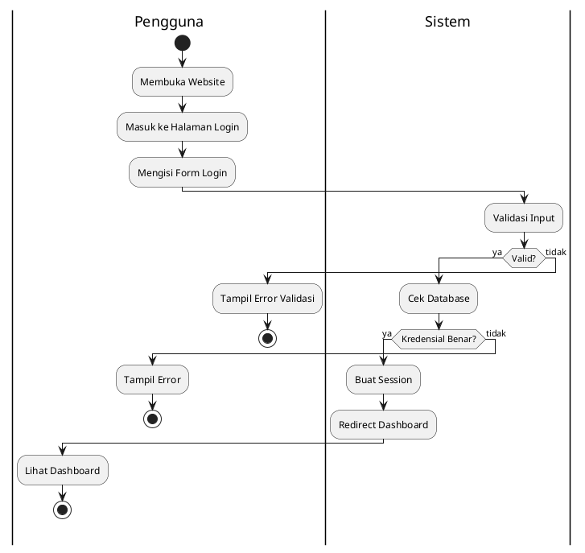

# Activity Diagram - Proses Login Sistem Akuntansi UMKM

## Judul Sistem
**Sistem Informasi Akuntansi dan Manajemen Produksi UMKM Berbasis Web**

## Deskripsi
Activity Diagram ini menggambarkan alur proses login pengguna ke dalam sistem informasi akuntansi UMKM, mulai dari membuka website hingga berhasil masuk ke dashboard aplikasi.

## Activity Diagram (PlantUML Format)

```plantuml
@startuml Activity_Diagram_Login
skinparam backgroundColor #FEFEFE
skinparam activity {
  BackgroundColor #FFF8DC
  BorderColor #8B4513
  FontSize 12
}
skinparam decision {
  BackgroundColor #FFE4B5
  BorderColor #8B4513
}

title Activity Diagram - Proses Login\nSistem Informasi Akuntansi UMKM

|Pengguna|
start
:Membuka Website;
note right
  URL: http://localhost:8000
  atau domain production
end note

:Masuk ke Halaman Login;
note right
  Route: /login
  View: auth/login.blade.php
end note

:Mengisi Username dan Password;
note right
  - Email/Username
  - Password
  - Remember Me (opsional)
end note

|Sistem|
:Validasi Input;
note right
  - Cek format email
  - Cek password tidak kosong
  - CSRF token validation
end note

if (Data Valid?) then (tidak)
  |Pengguna|
  :Menampilkan Pesan Error;
  note right
    - "Email/Password salah"
    - "Field wajib diisi"
  end note
  
  backward :Kembali ke Form Login;
else (ya)
  |Sistem|
  :Cek Kredensial di Database;
  note right
    Table: users
    - Cek email
    - Verify password (hash)
  end note
  
  if (Kredensial Benar?) then (tidak)
    |Pengguna|
    :Menampilkan Pesan Error;
    note right
      "Email atau password salah"
    end note
    
    backward :Kembali ke Form Login;
  else (ya)
    |Sistem|
    :Buat Session Login;
    note right
      - Set session user_id
      - Set auth token
      - Remember token (jika dipilih)
    end note
    
    :Redirect ke Dashboard;
    note right
      Route: /dashboard
      Controller: DashboardController
    end note
    
    |Pengguna|
    :Masuk ke Halaman Dashboard;
    note right
      Menampilkan:
      - Menu navigasi
      - Statistik ringkasan
      - Akses ke semua fitur
    end note
  endif
endif

stop

@enduml
```

## Penjelasan Alur

### 1. Start (Mulai)
Pengguna memulai proses dengan membuka website sistem.

### 2. Membuka Website
- **URL Development**: `http://localhost:8000`
- **URL Production**: Domain yang sudah di-deploy
- **File**: `routes/web.php` - Route welcome

### 3. Masuk ke Halaman Login
- **Route**: `GET /login`
- **Controller**: `Auth\LoginController`
- **View**: `resources/views/auth/login.blade.php`
- **Middleware**: `guest` (hanya untuk yang belum login)

### 4. Mengisi Username dan Password
Pengguna mengisi form dengan:
- **Email/Username**: Field input email
- **Password**: Field input password (encrypted)
- **Remember Me**: Checkbox opsional untuk remember token

### 5. Validasi Input (Sistem)
Sistem melakukan validasi:
```php
$request->validate([
    'email' => 'required|email',
    'password' => 'required|string',
]);
```

### 6. Decision: Data Valid?
- **Tidak**: Kembali ke form login dengan pesan error
- **Ya**: Lanjut ke pengecekan kredensial

### 7. Cek Kredensial di Database
Sistem mengecek di tabel `users`:
```php
if (Auth::attempt($credentials, $remember)) {
    // Login berhasil
}
```

### 8. Decision: Kredensial Benar?
- **Tidak**: Tampilkan error "Email atau password salah"
- **Ya**: Lanjut membuat session

### 9. Buat Session Login
Sistem membuat session:
- Set `user_id` di session
- Generate auth token
- Set remember token jika dipilih

### 10. Redirect ke Dashboard
- **Route**: `GET /dashboard`
- **Controller**: `DashboardController@index`
- **View**: `resources/views/dashboard.blade.php`
- **Middleware**: `auth` (harus sudah login)

### 11. Masuk ke Halaman Dashboard
Pengguna berhasil masuk dan melihat:
- **Menu Navigasi**: Sidebar dengan semua menu
- **Statistik**: Card statistik ringkasan
- **Akses Fitur**: Semua modul sistem

### 12. Stop (Selesai)
Proses login selesai, pengguna sudah di dalam sistem.

## File-file Terkait

### 1. Routes
```php
// routes/web.php
Route::get('/login', [LoginController::class, 'showLoginForm'])->name('login');
Route::post('/login', [LoginController::class, 'login']);
Route::post('/logout', [LoginController::class, 'logout'])->name('logout');
Route::get('/dashboard', [DashboardController::class, 'index'])->middleware('auth');
```

### 2. Controller
```php
// app/Http/Controllers/Auth/LoginController.php
public function login(Request $request)
{
    $credentials = $request->validate([
        'email' => 'required|email',
        'password' => 'required',
    ]);

    if (Auth::attempt($credentials, $request->filled('remember'))) {
        $request->session()->regenerate();
        return redirect()->intended('dashboard');
    }

    return back()->withErrors([
        'email' => 'Email atau password salah.',
    ]);
}
```

### 3. View Login
```blade
<!-- resources/views/auth/login.blade.php -->
<form method="POST" action="{{ route('login') }}">
    @csrf
    <input type="email" name="email" required>
    <input type="password" name="password" required>
    <input type="checkbox" name="remember">
    <button type="submit">Login</button>
</form>
```

### 4. Middleware
```php
// app/Http/Middleware/Authenticate.php
protected function redirectTo($request)
{
    if (! $request->expectsJson()) {
        return route('login');
    }
}
```

## Swimlane Diagram (Alternatif)

Jika ingin menggunakan swimlane untuk membedakan actor:



## Cara Menggunakan Diagram

### 1. Online (PlantUML Web)
1. Buka: http://www.plantuml.com/plantuml/uml/
2. Copy kode PlantUML di atas
3. Paste dan lihat hasilnya
4. Download sebagai PNG/SVG

### 2. VS Code
1. Install extension "PlantUML"
2. Buat file `.puml`
3. Paste kode di atas
4. Tekan `Alt+D` untuk preview

### 3. Draw.io
1. Buka draw.io
2. Pilih "Insert" > "Advanced" > "PlantUML"
3. Paste kode PlantUML
4. Atau buat manual mengikuti alur di atas

## Catatan Penting

### Keamanan
- Password di-hash menggunakan bcrypt
- CSRF protection aktif
- Session regeneration setelah login
- Rate limiting untuk prevent brute force

### Session Management
- Session timeout: 120 menit (default)
- Remember token: 2 minggu
- Session driver: file/database

### Error Handling
- Validasi input di client dan server
- Pesan error yang jelas
- Logging untuk failed login attempts

## Kesimpulan

Activity Diagram ini menggambarkan proses login yang:
1. ✅ Sesuai dengan kode Laravel yang ada
2. ✅ Mengikuti best practice keamanan
3. ✅ Mudah dipahami untuk dokumentasi
4. ✅ Dapat digunakan untuk skripsi/tugas akhir

Diagram ini dapat digunakan untuk:
- Dokumentasi sistem
- Presentasi
- Skripsi/Tugas Akhir
- Training pengguna baru
