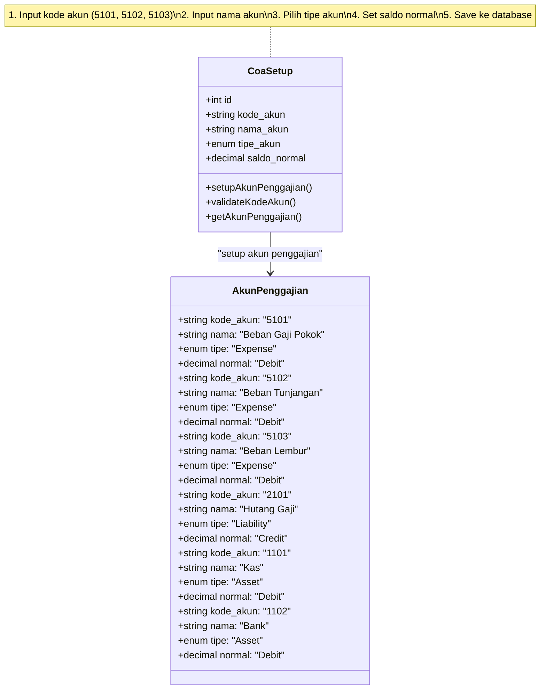
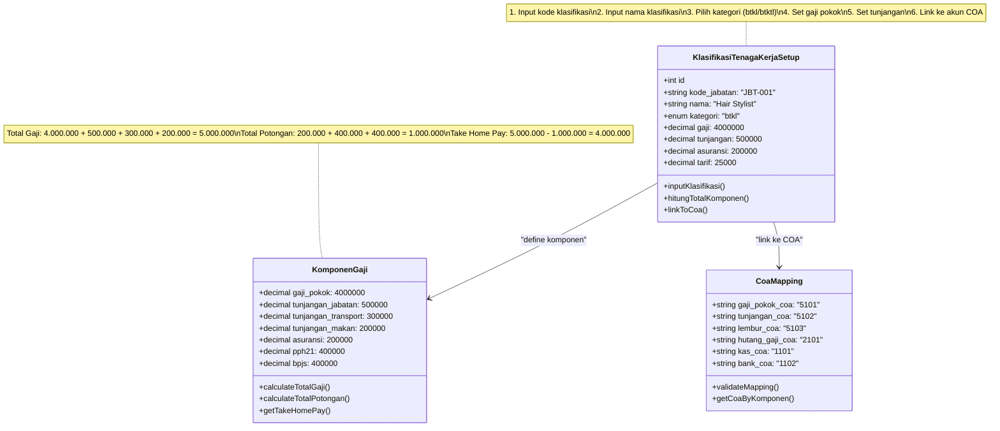
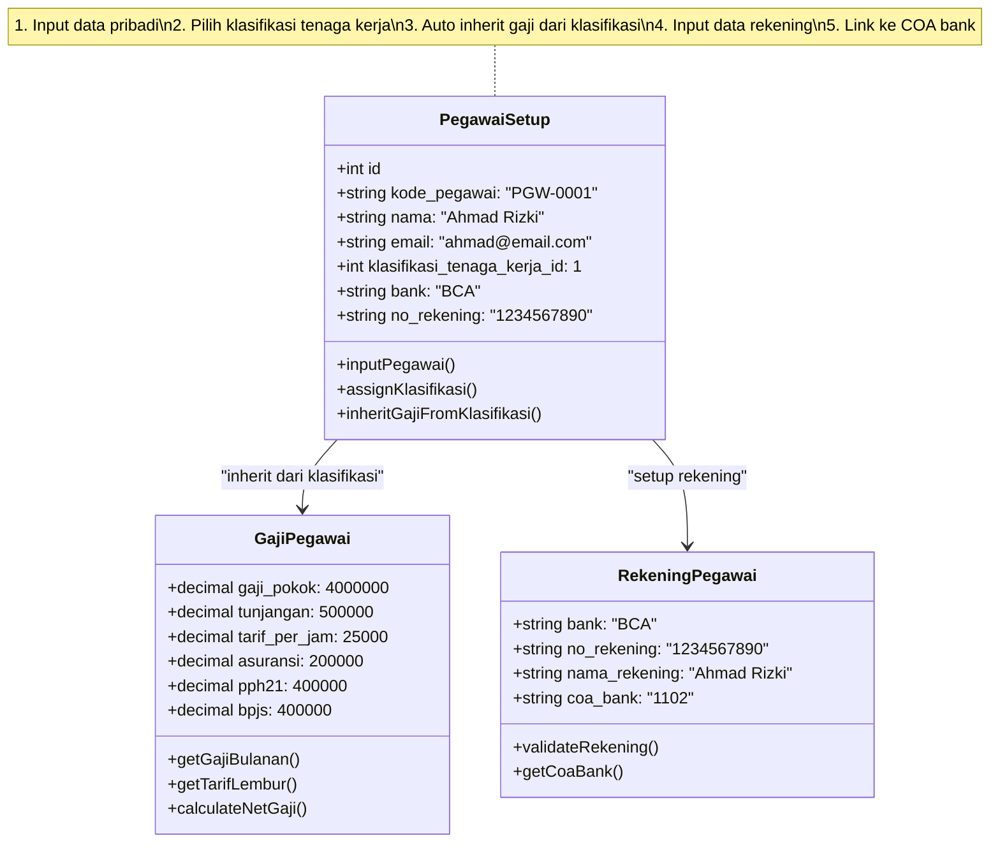
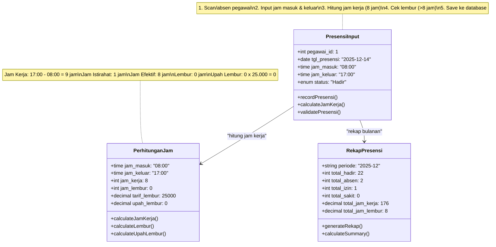
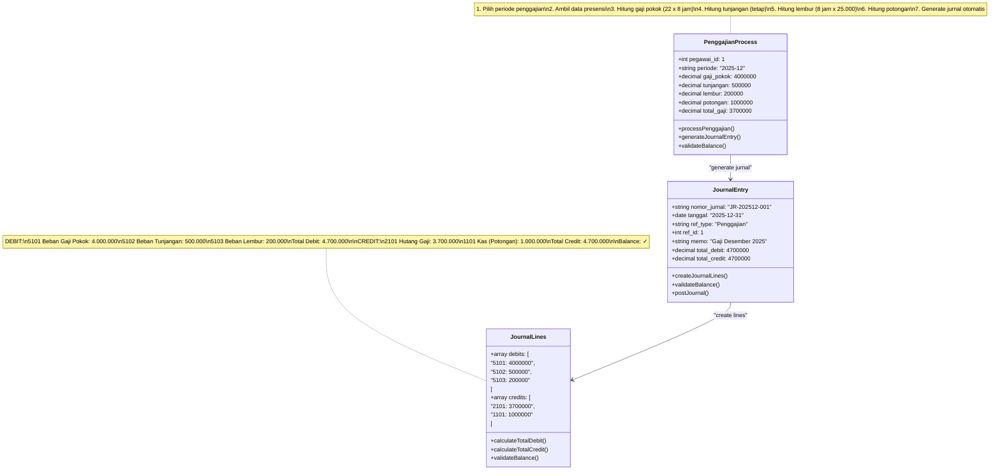
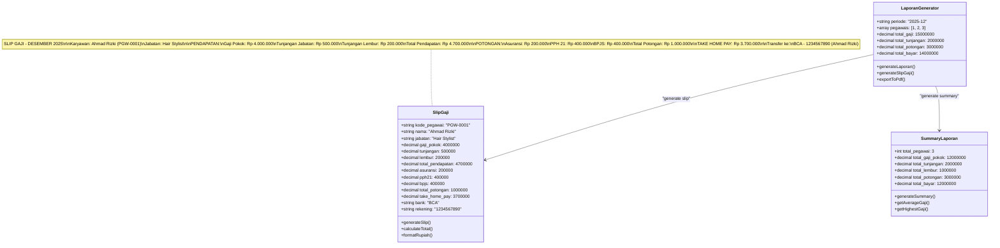
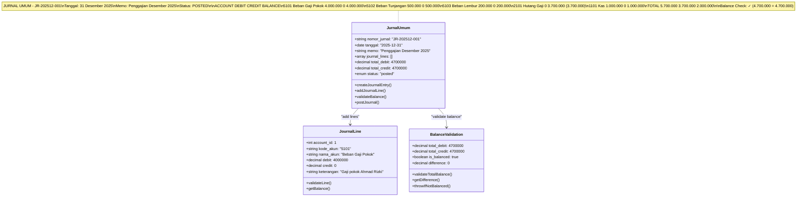
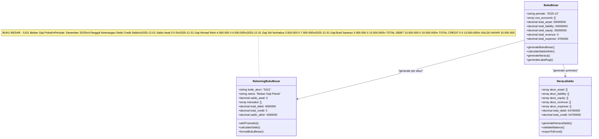
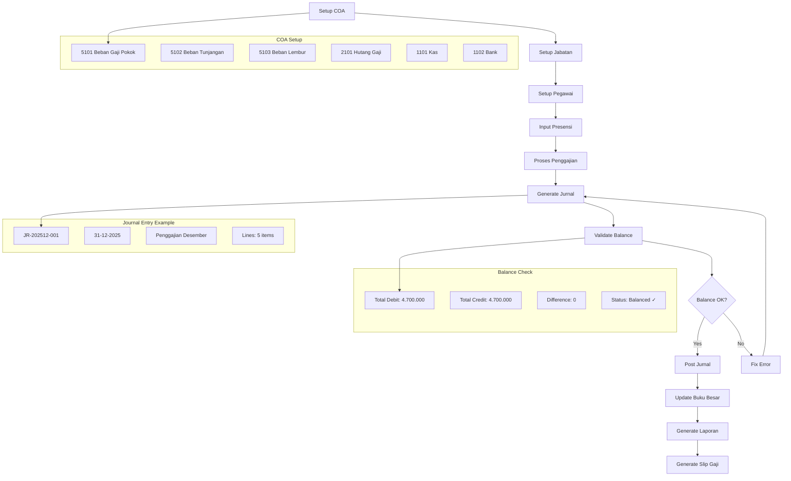
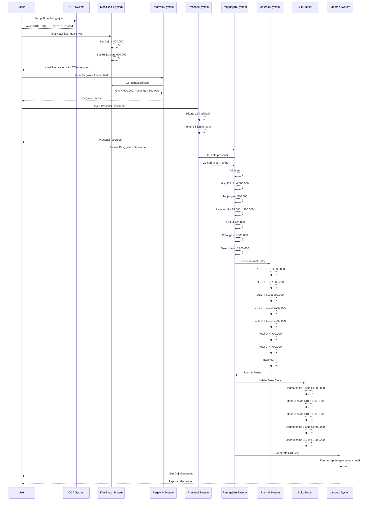

# Alur Pengisian Sistem Penggajian dengan Balance dan Akun Jurnal

## 1. Alur Pengisian COA (Chart of Accounts)

## 2. Alur Klasifikasi Tenaga Kerja dengan Gaji dan Tunjangan

## 3. Alur Pegawai dengan Integrasi Klasifikasi Tenaga Kerja dan COA

## 4. Alur Presensi dengan Perhitungan Jam Kerja

## 5. Alur Transaksi Penggajian dengan Jurnal Otomatis

## 6. Alur Laporan Penggajian dengan Slip Gaji

## 7. Alur Jurnal Umum dengan Balance Akun

## 8. Alur Buku Besar dengan Rekapitulasi

## 9. Alur Integrasi Lengkap dengan Balance Check

## 10. Contoh Transaksi Lengkap dengan Angka

## Kesimpulan

Alur ini menjamin:
1. **Balance Check** - Setiap jurnal otomatis divalidasi balance (Debit = Credit)
2. **COA Integration** - Setiap transaksi terlink ke akun yang benar
3. **Automated Calculation** - Perhitungan gaji, tunjangan, dan potongan otomatis
4. **Audit Trail** - Setiap transaksi tercatat di jurnal dan buku besar
5. **Compliance** - Mengikuti prinsip akuntansi double entry
6. **Reporting** - Laporan dan slip gaji otomatis tergenerate

Dengan alur ini, sistem penggajian akan selalu balance dan terintegrasi dengan sempurna ke sistem akuntansi.
