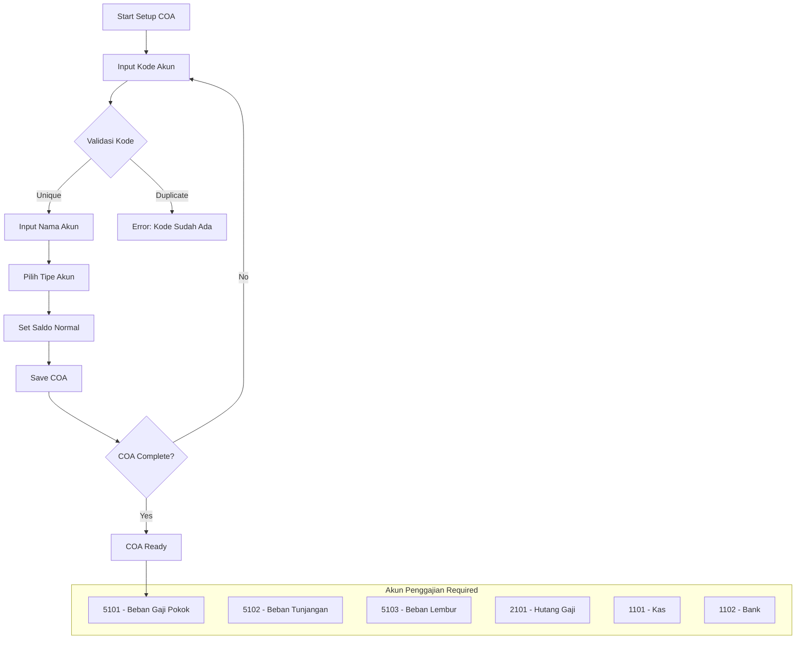
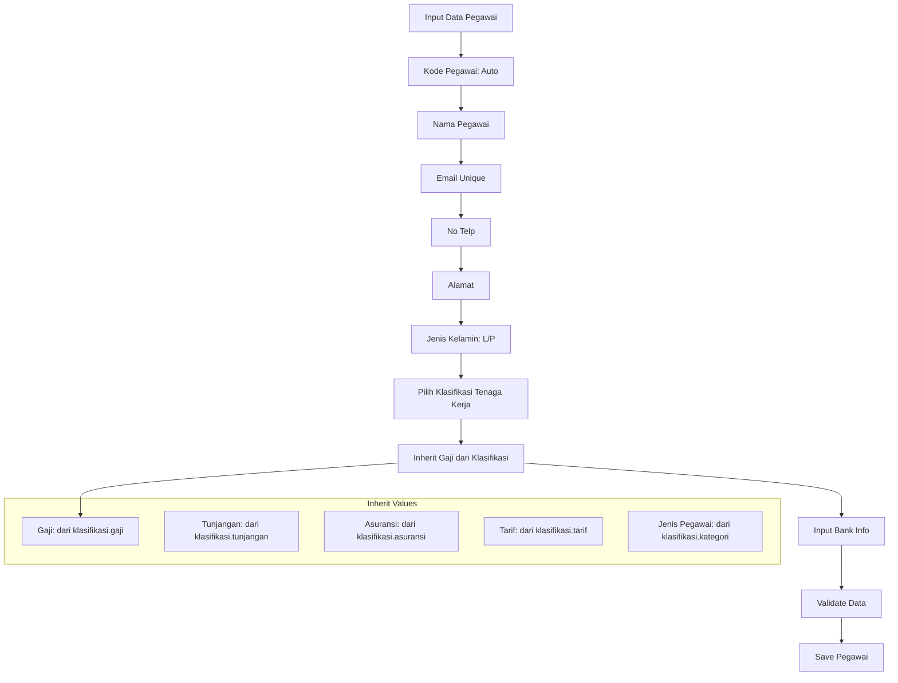
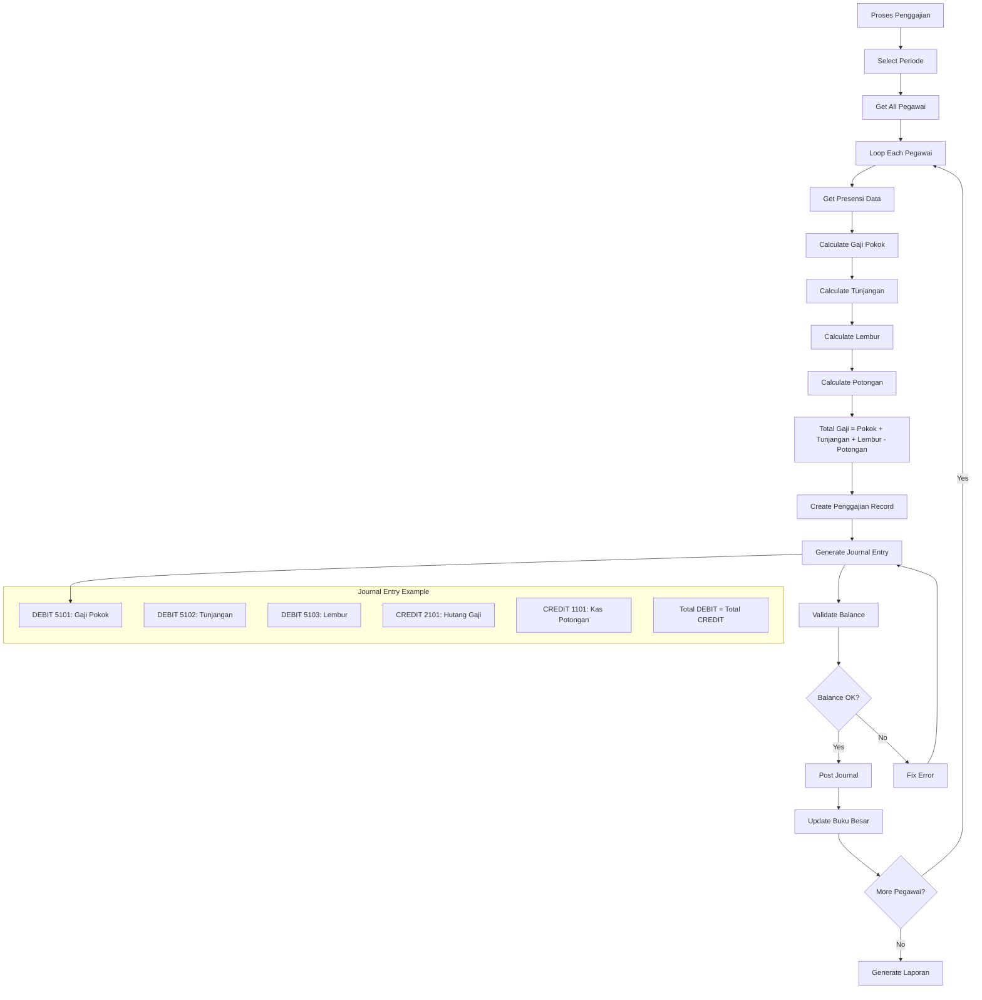
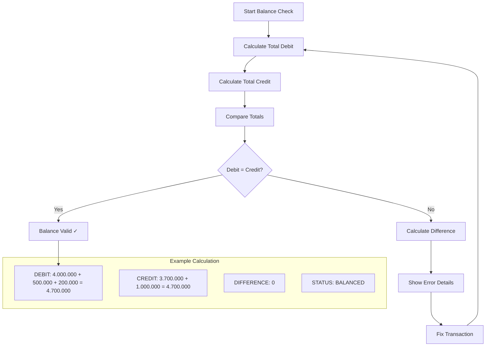
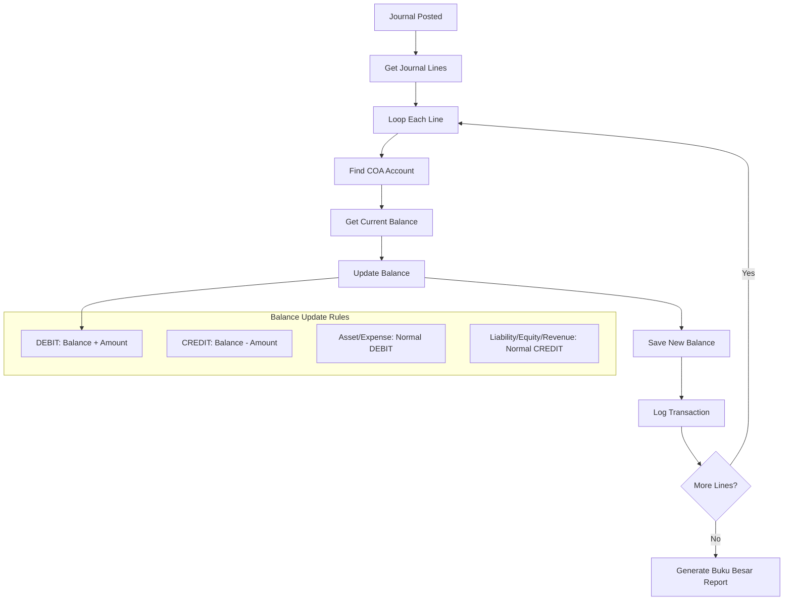
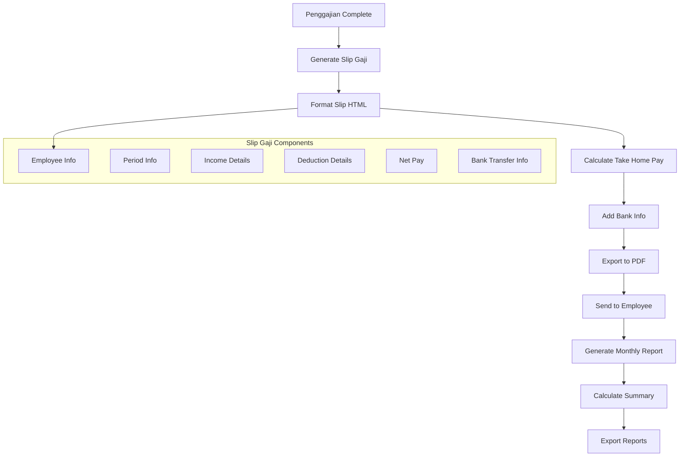
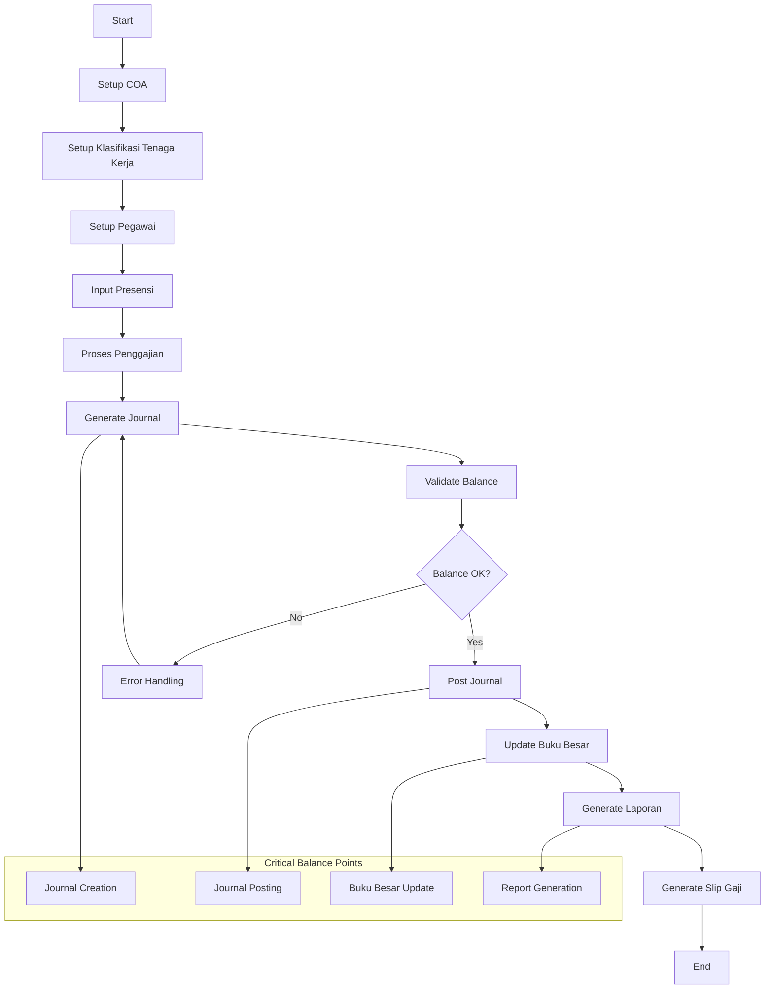
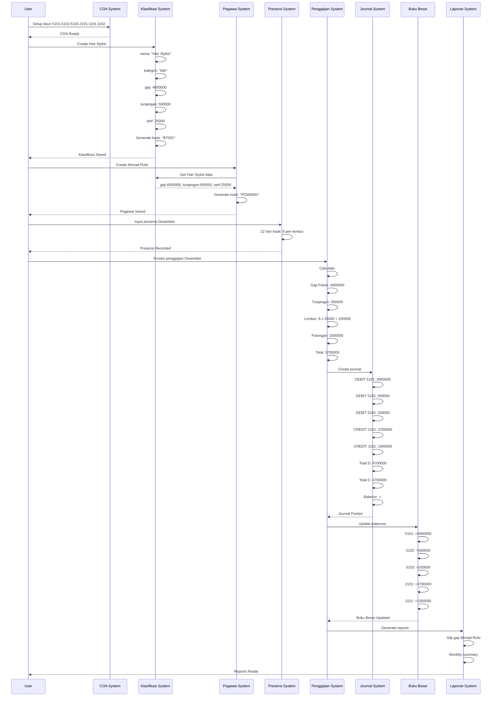
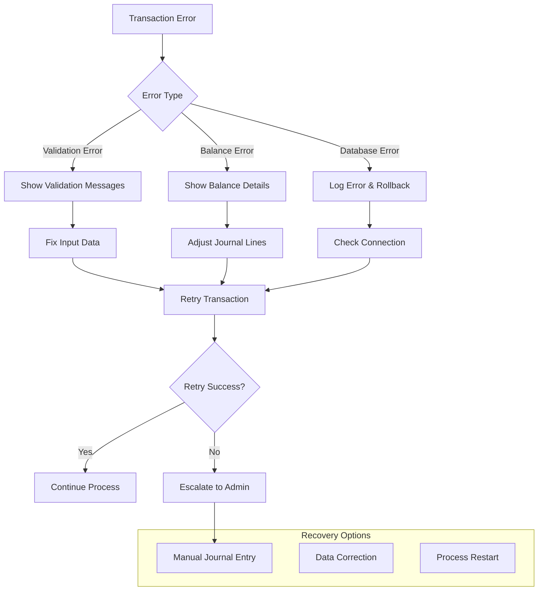

# Alur Lengkap Penggajian dengan Balance Check Sesuai Controller

## 1. Setup COA untuk Penggajian



## 2. Alur Klasifikasi Tenaga Kerja (Sesuai Controller)

```mermaid
flowchart TD
    A[Input Klasifikasi Tenaga Kerja] --> B[Nama Klasifikasi]
    B --> C[Kategori: btkl/btktl]
    C --> D[Input Gaji]
    D --> E[Input Tunjangan]
    E --> F[Input Asuransi]
    F --> G[Input Tarif]
    G --> H[Normalize Money Values]
    H --> I[Generate Kode Jabatan]
    I --> J[Validate Data]
    J --> K[Save Jabatan]
    K --> L[Save Tunjangan Tambahan]
    L --> M[Success]
    
    subgraph "Validasi Controller"
        N[nama: required]
        O[kategori: required|in:btkl,btktl]
        P[tunjangan: nullable|numeric|min:0]
        Q[asuransi: nullable|numeric|min:0]
        R[gaji: nullable|numeric|min:0]
        S[tarif: nullable|numeric|min:0]
    end
    
    H --> N
```

## 3. Alur Pegawai dengan Inherit dari Klasifikasi



## 4. Alur Presensi dengan Perhitungan

```mermaid
flowchart TD
    A[Input Presensi] --> B[Select Pegawai]
    B --> C[Tanggal Presensi]
    C --> D[Jam Masuk]
    D --> E[Jam Keluar]
    E --> F[Status: Hadir/Absen/Izin/Sakit]
    F --> G{Validate Time}
    G -->|Valid| H[Calculate Jam Kerja]
    G -->|Invalid| I[Error: Jam Tidak Valid]
    H --> J[Check Lembur]
    J --> K[Calculate Lembur Hours]
    K --> L[Save Presensi]
    L --> M[Update Summary]
    
    subgraph "Perhitungan Jam"
        N[Jam Kerja = Jam Keluar - Jam Masuk]
        O[Jam Istirahat = 1 jam]
        P[Jam Efektif = Jam Kerja - Jam Istirahat]
        Q[Lembur = Max(0, Jam Efektif - 8)]
        R[Upah Lembur = Lembur x Tarif per Jam]
    end
    
    H --> N
```

## 5. Alur Penggajian dengan Jurnal Otomatis



## 6. Balance Check Detail



## 7. Alur Buku Besar Update



## 8. Alur Laporan dan Slip Gaji



## 9. Integrasi Complete Flow dengan Balance Check



## 10. Contoh Transaksi Real dengan Angka



## 11. Validation Rules Sesuai Controller

```mermaid
flowchart TD
    A[Input Validation] --> B[Klasifikasi Validation]
    B --> C[Pegawai Validation]
    C --> D[Presensi Validation]
    D --> E[Penggajian Validation]
    E --> F[Journal Validation]
    
    subgraph "KlasifikasiTenagaKerjaController"
        G[nama: required|string|max:255]
        H[kategori: required|in:btkl,btktl]
        I[tunjangan: nullable|numeric|min:0]
        J[asuransi: nullable|numeric|min:0]
        K[gaji: nullable|numeric|min:0]
        L[tarif: nullable|numeric|min:0]
    end
    
    subgraph "Money Normalization"
        M[Format 1.234,56 → 1234.56]
        N[Format 1,234.56 → 1234.56]
        O[Remove spaces and commas]
    end
    
    B --> G
    B --> M
```

## 12. Error Handling dan Recovery



## Kesimpulan

Alur ini mengikuti controller yang ada dengan:

1. **KlasifikasiTenagaKerjaController** - Validasi btkl/btktl, normalize money, auto-generate kode
2. **Balance Check** - Setiap jurnal harus balance (Debit = Credit)
3. **COA Integration** - Semua transaksi terlink ke akun yang benar
4. **Audit Trail** - Setiap step tercatat dan dapat dilacak
5. **Error Recovery** - Handle error dengan recovery options
6. **Real Numbers** - Contoh dengan angka aktual untuk demonstrasi

Sistem menjamin integritas data dan compliance akuntansi di setiap step.
