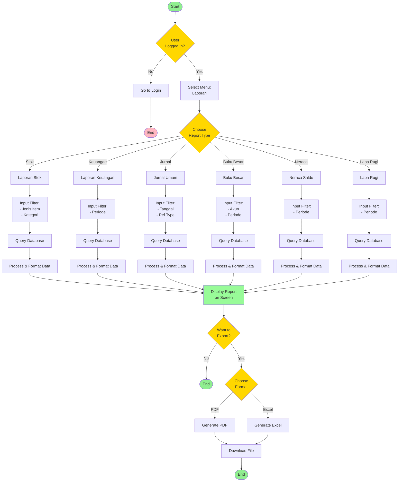

# Activity Diagram & Class Diagram - Sistem UMKM COE

## 1. Activity Diagram - Proses Produksi Lengkap

```mermaid
graph TB
    Start([Start]) --> LoginCheck{User<br/>Logged In?}
    
    LoginCheck -->|No| Login[Login Page]
    Login --> Auth{Authentication<br/>Valid?}
    Auth -->|No| Login
    Auth -->|Yes| Dashboard
    
    LoginCheck -->|Yes| Dashboard[Dashboard]
    
    Dashboard --> MenuProduksi[Select Menu:<br/>Transaksi > Produksi]
    
    MenuProduksi --> LoadForm[Load Form Produksi]
    
    LoadForm --> GetProduk[Get List Produk<br/>yang Punya BOM]
    
    GetProduk --> DisplayForm[Display Form]
    
    DisplayForm --> InputData[Admin Input:<br/>- Produk<br/>- Tanggal<br/>- Qty]
    
    InputData --> Submit[Submit Form]
    
    Submit --> ValidateInput{Validate<br/>Input}
    
    ValidateInput -->|Invalid| ShowError1[Show Validation<br/>Error]
    ShowError1 --> DisplayForm
    
    ValidateInput -->|Valid| CheckBOM{Check BOM<br/>Exists?}
    
    CheckBOM -->|No| ShowError2[Show Error:<br/>BOM Belum Ada]
    ShowError2 --> End1([End])
    
    CheckBOM -->|Yes| GetBOMDetails[Get BOM Details<br/>& Calculate Needs]
    
    GetBOMDetails --> CheckStock{Check Stock<br/>All Materials<br/>Sufficient?}
    
    CheckStock -->|No| ShowError3[Show Error:<br/>Stock Insufficient<br/>List Missing Items]
    ShowError3 --> End2([End])
    
    CheckStock -->|Yes| StartTransaction[Begin Database<br/>Transaction]
    
    StartTransaction --> CreateProduksi[Create Produksi<br/>Record]
    
    CreateProduksi --> LoopMaterials[Loop Each Material<br/>in BOM]
    
    LoopMaterials --> ConvertUnit[Convert Unit<br/>Recipe to Base]
    
    ConvertUnit --> ConsumeFIFO[Consume Stock<br/>FIFO Method]
    
    ConsumeFIFO --> UpdateMaterialStock[Update Material<br/>Stock Master]
    
    UpdateMaterialStock --> CreateDetail[Create<br/>ProduksiDetail]
    
    CreateDetail --> NextMaterial{More<br/>Materials?}
    
    NextMaterial -->|Yes| LoopMaterials
    
    NextMaterial -->|No| CalculateCost[Calculate Total Cost:<br/>- Material Cost<br/>- BTKL 20%<br/>- BOP 10%]
    
    CalculateCost --> UpdateProduksi[Update Produksi<br/>with Total Cost]
    
    UpdateProduksi --> CalculateUnitCost[Calculate<br/>Unit Cost]
    
    CalculateUnitCost --> AddProductLayer[Add Product<br/>Stock Layer]
    
    AddProductLayer --> UpdateProductStock[Update Product<br/>Stock Master]
    
    UpdateProductStock --> PostJournal1[Post Journal 1:<br/>Dr. WIP<br/>Cr. Material Stock]
    
    PostJournal1 --> PostJournal2[Post Journal 2:<br/>Dr. WIP<br/>Cr. Labor & Overhead]
    
    PostJournal2 --> PostJournal3[Post Journal 3:<br/>Dr. Finished Goods<br/>Cr. WIP]
    
    PostJournal3 --> CommitTransaction[Commit<br/>Transaction]
    
    CommitTransaction --> ShowSuccess[Show Success<br/>Message]
    
    ShowSuccess --> RedirectDetail[Redirect to<br/>Production Detail]
    
    RedirectDetail --> End3([End])
    
    style Start fill:#90EE90
    style End1 fill:#FFB6C1
    style End2 fill:#FFB6C1
    style End3 fill:#90EE90
    style LoginCheck fill:#FFD700
    style Auth fill:#FFD700
    style ValidateInput fill:#FFD700
    style CheckBOM fill:#FFD700
    style CheckStock fill:#FFD700
    style NextMaterial fill:#FFD700
    style ShowError1 fill:#FF6B6B
    style ShowError2 fill:#FF6B6B
    style ShowError3 fill:#FF6B6B
    style StartTransaction fill:#E1D5E7
    style CommitTransaction fill:#E1D5E7
    style ShowSuccess fill:#98FB98
```

---

## 2. Activity Diagram - Proses Pembuatan Laporan

---

## 3. Class Diagram - Struktur Aplikasi

```mermaid
classDiagram
    class User {
        +int id
        +string name
        +string email
        +string password
        +string role
        +login()
        +logout()
        +hasRole()
    }
    
    class Produk {
        +int id
        +string kode_produk
        +string nama_produk
        +decimal stok
        +decimal harga_jual
        +decimal btkl_default
        +decimal bop_default
        +boms()
        +produksis()
        +stockLayers()
        +calculateHPP()
    }
    
    class BahanBaku {
        +int id
        +string kode_bahan
        +string nama_bahan
        +decimal stok
        +decimal harga_satuan
        +int satuan_id
        +boms()
        +pembelianDetails()
        +produksiDetails()
        +stockLayers()
        +getAvailableStock()
    }
    
    class Bom {
        +int id
        +int produk_id
        +int bahan_baku_id
        +decimal jumlah
        +string satuan_resep
        +decimal harga_satuan
        +produk()
        +bahanBaku()
        +calculateCost()
    }
    
    class Produksi {
        +int id
        +int produk_id
        +date tanggal
        +decimal qty_produksi
        +decimal total_bahan
        +decimal total_btkl
        +decimal total_bop
        +decimal total_biaya
        +string status
        +produk()
        +details()
        +calculateTotalCost()
        +postJournals()
    }
    
    class ProduksiDetail {
        +int id
        +int produksi_id
        +int bahan_baku_id
        +decimal qty_resep
        +string satuan_resep
        +decimal qty_konversi
        +decimal harga_satuan
        +decimal subtotal
        +produksi()
        +bahanBaku()
    }
    
    class StockLayer {
        +int id
        +string type
        +int item_id
        +decimal qty
        +string unit
        +decimal unit_cost
        +string ref_type
        +int ref_id
        +date tanggal
        +item()
        +reference()
        +consumeFIFO()
    }
    
    class Pembelian {
        +int id
        +string no_pembelian
        +int vendor_id
        +date tanggal
        +decimal total
        +decimal dp
        +decimal sisa
        +string status
        +vendor()
        +details()
        +settlements()
        +postJournal()
    }
    
    class Penjualan {
        +int id
        +string no_penjualan
        +date tanggal
        +decimal total
        +decimal diskon
        +decimal grand_total
        +string payment_method
        +details()
        +postJournal()
        +updateStock()
    }
    
    class Coa {
        +int id
        +string kode_akun
        +string nama_akun
        +string kategori_akun
        +string tipe_akun
        +string saldo_normal
        +decimal saldo_awal
        +jurnalUmum()
        +periodBalances()
        +getSaldoPeriode()
    }
    
    class CoaPeriod {
        +int id
        +string periode
        +date tanggal_mulai
        +date tanggal_selesai
        +boolean is_closed
        +balances()
        +getCurrentPeriod()
        +getPreviousPeriod()
        +getNextPeriod()
    }
    
    class CoaPeriodBalance {
        +int id
        +string kode_akun
        +int period_id
        +decimal saldo_awal
        +decimal saldo_akhir
        +boolean is_posted
        +coa()
        +period()
    }
    
    class JurnalUmum {
        +int id
        +int coa_id
        +date tanggal
        +text keterangan
        +decimal debit
        +decimal kredit
        +string referensi
        +string tipe_referensi
        +coa()
        +createdBy()
    }
    
    class StockService {
        +consume()
        +addLayer()
        +getAvailableQty()
        +calculateFIFO()
    }
    
    class JournalService {
        +post()
        +deleteByRef()
        +getByPeriod()
    }
    
    class UnitConverter {
        +convert()
        +getConversionFactor()
    }
    
    class ProduksiController {
        +index()
        +create()
        +store()
        +show()
        +destroy()
        +complete()
    }
    
    class LaporanController {
        +stok()
        +pembelian()
        +penjualan()
        +keuangan()
    }
    
    class AkuntansiController {
        +jurnalUmum()
        +bukuBesar()
        +neracaSaldo()
        +labaRugi()
    }
    
    class CoaPeriodController {
        +postPeriod()
        +reopenPeriod()
    }
    
    %% Relationships
    Produk "1" --> "*" Bom : has
    BahanBaku "1" --> "*" Bom : used in
    Produk "1" --> "*" Produksi : produced in
    Produksi "1" --> "*" ProduksiDetail : contains
    BahanBaku "1" --> "*" ProduksiDetail : consumed in
    Produk "1" --> "*" StockLayer : has
    BahanBaku "1" --> "*" StockLayer : has
    Produksi "1" --> "*" StockLayer : creates
    Pembelian "1" --> "*" StockLayer : creates
    Penjualan "1" --> "*" StockLayer : consumes
    Coa "1" --> "*" JurnalUmum : records
    Coa "1" --> "*" CoaPeriodBalance : has
    CoaPeriod "1" --> "*" CoaPeriodBalance : contains
    
    ProduksiController ..> Produksi : uses
    ProduksiController ..> StockService : uses
    ProduksiController ..> JournalService : uses
    ProduksiController ..> UnitConverter : uses
    
    LaporanController ..> Produk : uses
    LaporanController ..> BahanBaku : uses
    LaporanController ..> Pembelian : uses
    LaporanController ..> Penjualan : uses
    
    AkuntansiController ..> JurnalUmum : uses
    AkuntansiController ..> Coa : uses
    AkuntansiController ..> CoaPeriod : uses
    
    CoaPeriodController ..> CoaPeriod : uses
    CoaPeriodController ..> CoaPeriodBalance : uses
    CoaPeriodController ..> JurnalUmum : uses
```

---

## Penjelasan Class Diagram

### Layer Arsitektur

#### 1. **Controller Layer**
- `ProduksiController` - Menangani proses produksi
- `LaporanController` - Menangani laporan
- `AkuntansiController` - Menangani akuntansi
- `CoaPeriodController` - Menangani periode COA

#### 2. **Service Layer**
- `StockService` - Mengelola stok dengan metode FIFO
- `JournalService` - Mengelola posting jurnal
- `UnitConverter` - Konversi satuan

#### 3. **Model Layer**
- **Master Data**: Produk, BahanBaku, Coa, dll
- **Transaction**: Produksi, Pembelian, Penjualan
- **Accounting**: JurnalUmum, CoaPeriod, CoaPeriodBalance
- **Inventory**: StockLayer

---

## Design Patterns yang Digunakan

### 1. **MVC (Model-View-Controller)**
- **Model**: Eloquent ORM models
- **View**: Blade templates
- **Controller**: HTTP Controllers

### 2. **Service Pattern**
- `StockService` - Business logic untuk stok
- `JournalService` - Business logic untuk jurnal
- Memisahkan business logic dari controller

### 3. **Repository Pattern** (Implicit via Eloquent)
- Eloquent ORM sebagai data access layer
- Query builder untuk complex queries

### 4. **Observer Pattern**
- Model events (creating, created, updating, updated)
- Untuk auto-generate kode, update timestamps

### 5. **Factory Pattern**
- Model factories untuk testing
- Seeder untuk sample data

---

## Prinsip SOLID

### Single Responsibility Principle (SRP)
✅ Setiap class punya satu tanggung jawab
- `StockService` hanya handle stok
- `JournalService` hanya handle jurnal

### Open/Closed Principle (OCP)
✅ Open for extension, closed for modification
- Service dapat di-extend tanpa ubah code existing

### Liskov Substitution Principle (LSP)
✅ Subclass dapat menggantikan parent class
- Polymorphic relationships (StockLayer)

### Interface Segregation Principle (ISP)
✅ Interface spesifik untuk kebutuhan tertentu
- Service interfaces yang focused

### Dependency Inversion Principle (DIP)
✅ Depend on abstractions, not concretions
- Dependency injection via Laravel container

---

## Kesimpulan

Sistem UMKM COE dibangun dengan:
1. ✅ **Arsitektur MVC** yang jelas dan terstruktur
2. ✅ **Service Layer** untuk business logic
3. ✅ **Design Patterns** yang proven dan maintainable
4. ✅ **SOLID Principles** untuk code quality
5. ✅ **Separation of Concerns** yang baik
6. ✅ **Testable** dan mudah di-maintain
7. ✅ **Scalable** untuk pengembangan future
