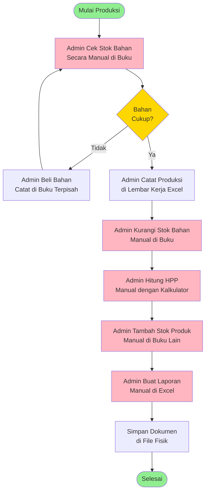
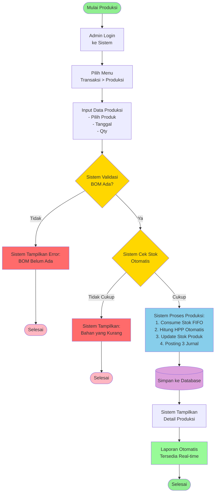
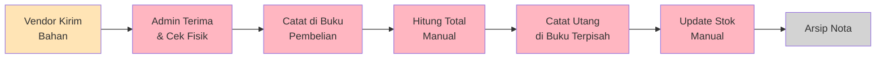
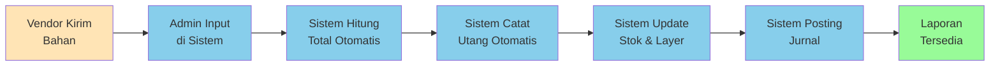
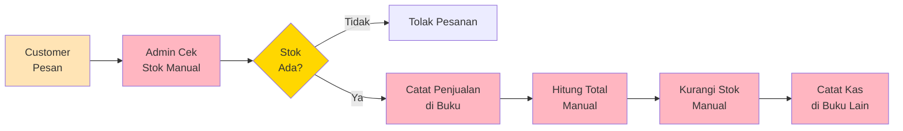
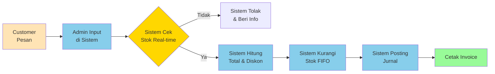
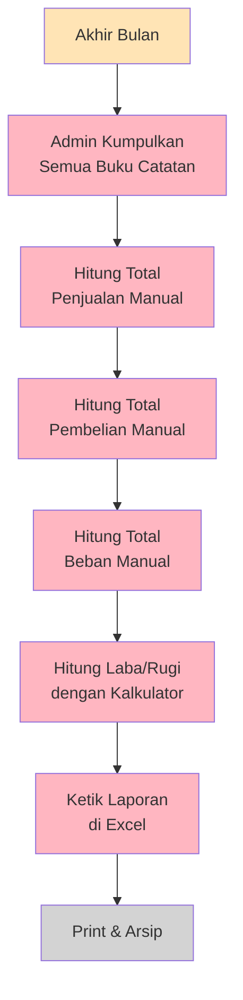
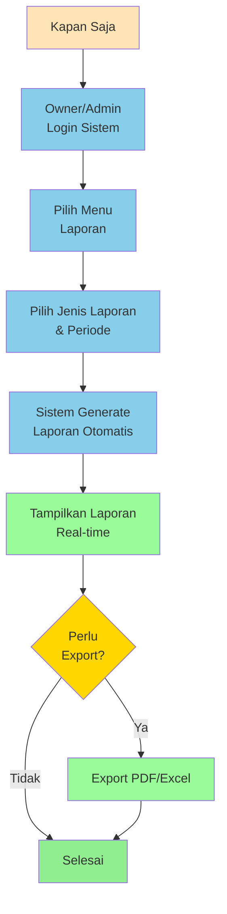

# BPMN Sistem Saat Ini (As-Is) dan Sistem Usulan (To-Be)

## 1. BPMN Sistem Saat Ini (As-Is) - Proses Produksi Manual

### Masalah Sistem Saat Ini:

| No | Masalah | Dampak |
|----|---------|--------|
| 1 | Pencatatan terpisah di buku/spreadsheet berbeda | Data tidak terintegrasi, sulit tracking |
| 2 | Pengecekan stok manual | Memakan waktu, sering terlambat |
| 3 | Perhitungan HPP manual | Rawan kesalahan, tidak akurat |
| 4 | Update stok manual | Risiko lupa update, data tidak real-time |
| 5 | Pembuatan laporan manual | Memakan waktu, sulit analisis |
| 6 | Tidak ada validasi otomatis | Kesalahan input tidak terdeteksi |
| 7 | Tidak ada jurnal akuntansi | Laporan keuangan tidak standar |
| 8 | Arsip fisik | Sulit dicari, risiko hilang |

---

## 2. BPMN Sistem Usulan (To-Be) - Proses Produksi dengan UMKM COE

### Keunggulan Sistem Usulan:

| No | Fitur | Manfaat |
|----|-------|---------|
| 1 | Database terpusat | Semua data terintegrasi, mudah diakses |
| 2 | Validasi otomatis | Mencegah kesalahan input |
| 3 | Cek stok real-time | Tahu langsung ketersediaan bahan |
| 4 | Perhitungan HPP otomatis | Akurat, cepat, konsisten |
| 5 | Update stok otomatis | Data selalu up-to-date |
| 6 | Posting jurnal otomatis | Laporan keuangan standar akuntansi |
| 7 | Laporan real-time | Bisa diakses kapan saja |
| 8 | Metode FIFO | Perhitungan biaya lebih akurat |
| 9 | Audit trail | Semua transaksi tercatat |
| 10 | Multi-user | Bisa diakses bersamaan |

---

## 3. BPMN Proses Pembelian Bahan Baku

### Sistem Saat Ini (As-Is)

### Sistem Usulan (To-Be)

---

## 4. BPMN Proses Penjualan Produk

### Sistem Saat Ini (As-Is)

### Sistem Usulan (To-Be)

---

## 5. BPMN Proses Pelaporan Keuangan

### Sistem Saat Ini (As-Is)

### Sistem Usulan (To-Be)

---

## Perbandingan Waktu Proses

| Proses | Sistem Saat Ini | Sistem Usulan | Efisiensi |
|--------|----------------|---------------|-----------|
| Input Produksi | 15-20 menit | 2-3 menit | 85% lebih cepat |
| Cek Stok Bahan | 10-15 menit | Real-time (< 1 detik) | 99% lebih cepat |
| Hitung HPP | 20-30 menit | Otomatis (< 1 detik) | 99% lebih cepat |
| Update Stok | 10 menit | Otomatis | 100% lebih cepat |
| Buat Laporan Bulanan | 4-6 jam | 1-2 menit | 99% lebih cepat |
| Cari Data Lama | 30-60 menit | < 10 detik | 99% lebih cepat |

---

## Kesimpulan

Sistem UMKM COE memberikan peningkatan signifikan dalam:
1. ✅ **Efisiensi Waktu** - Proses 85-99% lebih cepat
2. ✅ **Akurasi Data** - Validasi otomatis, perhitungan konsisten
3. ✅ **Integrasi Data** - Semua data terhubung dalam satu sistem
4. ✅ **Real-time Information** - Data selalu up-to-date
5. ✅ **Standar Akuntansi** - Jurnal dan laporan sesuai standar
6. ✅ **Kemudahan Akses** - Bisa diakses kapan saja, dimana saja
7. ✅ **Audit Trail** - Semua transaksi tercatat lengkap
8. ✅ **Skalabilitas** - Mudah dikembangkan sesuai kebutuhan
