# Entity Relationship Diagram (ERD) - Sistem UMKM COE

## ERD Lengkap Sistem

```mermaid
erDiagram
    USERS ||--o{ PRODUKSI : creates
    USERS ||--o{ PEMBELIAN : creates
    USERS ||--o{ PENJUALAN : creates
    
    PRODUK ||--o{ BOM : "has many"
    PRODUK ||--o{ PENJUALAN_DETAIL : "sold in"
    PRODUK ||--o{ PRODUKSI : "produced in"
    PRODUK ||--o{ STOCK_LAYER : "has stock"
    
    BAHAN_BAKU ||--o{ BOM : "used in"
    BAHAN_BAKU ||--o{ PEMBELIAN_DETAIL : "purchased in"
    BAHAN_BAKU ||--o{ PRODUKSI_DETAIL : "consumed in"
    BAHAN_BAKU ||--o{ STOCK_LAYER : "has stock"
    BAHAN_BAKU ||--|| SATUAN : "has unit"
    
    VENDOR ||--o{ PEMBELIAN : "supplies"
    
    PEGAWAI ||--o{ PENGGAJIAN : "receives"
    PEGAWAI ||--|| JABATAN : "has position"
    
    COA ||--o{ JURNAL_UMUM : "records"
    COA ||--o{ BOP : "categorizes"
    COA ||--o{ COA_PERIOD_BALANCE : "has balance"
    
    COA_PERIOD ||--o{ COA_PERIOD_BALANCE : "contains"
    
    PEMBELIAN ||--o{ PEMBELIAN_DETAIL : "contains"
    PEMBELIAN ||--o{ AP_SETTLEMENT : "paid by"
    PEMBELIAN ||--o{ RETUR : "returned in"
    
    PENJUALAN ||--o{ PENJUALAN_DETAIL : "contains"
    PENJUALAN ||--o{ RETUR : "returned in"
    
    PRODUKSI ||--o{ PRODUKSI_DETAIL : "contains"
    PRODUKSI ||--o{ STOCK_LAYER : "creates"
    
    ASET ||--|| JENIS_ASET : "categorized by"
    ASET ||--|| KATEGORI_ASET : "grouped by"
    
    USERS {
        bigint id PK
        string name
        string email
        string password
        string role
        timestamp created_at
    }
    
    PRODUK {
        bigint id PK
        string kode_produk
        string nama_produk
        decimal stok
        decimal harga_jual
        decimal btkl_default
        decimal bop_default
        decimal harga_pokok
        string kategori
        text deskripsi
    }
    
    BAHAN_BAKU {
        bigint id PK
        string kode_bahan
        string nama_bahan
        decimal stok
        decimal harga_satuan
        bigint satuan_id FK
        decimal min_stok
    }
    
    BOM {
        bigint id PK
        bigint produk_id FK
        bigint bahan_baku_id FK
        decimal jumlah
        string satuan_resep
        decimal harga_satuan
        decimal subtotal
    }
    
    VENDOR {
        bigint id PK
        string kode_vendor
        string nama_vendor
        string alamat
        string telepon
        string email
        string kategori
    }
    
    PEMBELIAN {
        bigint id PK
        string no_pembelian
        bigint vendor_id FK
        date tanggal
        decimal total
        decimal dp
        decimal sisa
        string status
        string payment_method
    }
    
    PEMBELIAN_DETAIL {
        bigint id PK
        bigint pembelian_id FK
        bigint bahan_baku_id FK
        decimal qty
        decimal harga
        decimal subtotal
        string satuan
    }
    
    PENJUALAN {
        bigint id PK
        string no_penjualan
        date tanggal
        decimal total
        decimal diskon
        decimal grand_total
        string payment_method
        string status
    }
    
    PENJUALAN_DETAIL {
        bigint id PK
        bigint penjualan_id FK
        bigint produk_id FK
        decimal qty
        decimal harga
        decimal subtotal
    }
    
    PRODUKSI {
        bigint id PK
        bigint produk_id FK
        date tanggal
        decimal qty_produksi
        decimal total_bahan
        decimal total_btkl
        decimal total_bop
        decimal total_biaya
        string status
        text catatan
    }
    
    PRODUKSI_DETAIL {
        bigint id PK
        bigint produksi_id FK
        bigint bahan_baku_id FK
        decimal qty_resep
        string satuan_resep
        decimal qty_konversi
        decimal harga_satuan
        decimal subtotal
    }
    
    STOCK_LAYER {
        bigint id PK
        string type
        bigint item_id
        decimal qty
        string unit
        decimal unit_cost
        string ref_type
        bigint ref_id
        date tanggal
    }
    
    PEGAWAI {
        bigint id PK
        string kode_pegawai
        string nama
        bigint jabatan_id FK
        decimal gaji_pokok
        decimal tunjangan
        string kategori_tenaga_kerja
        decimal tarif_per_jam
        string status
    }
    
    JABATAN {
        bigint id PK
        string nama_jabatan
        text deskripsi
    }
    
    PENGGAJIAN {
        bigint id PK
        bigint pegawai_id FK
        date tanggal_penggajian
        decimal gaji_pokok
        decimal tunjangan
        decimal potongan
        decimal total_gaji
        string coa_kasbank
    }
    
    COA {
        bigint id PK
        string kode_akun
        string nama_akun
        string kategori_akun
        string tipe_akun
        string kode_induk
        string saldo_normal
        decimal saldo_awal
        date tanggal_saldo_awal
        boolean is_akun_header
        boolean posted_saldo_awal
    }
    
    COA_PERIOD {
        bigint id PK
        string periode
        date tanggal_mulai
        date tanggal_selesai
        boolean is_closed
        timestamp closed_at
        bigint closed_by FK
    }
    
    COA_PERIOD_BALANCE {
        bigint id PK
        string kode_akun FK
        bigint period_id FK
        decimal saldo_awal
        decimal saldo_akhir
        boolean is_posted
    }
    
    JURNAL_UMUM {
        bigint id PK
        bigint coa_id FK
        date tanggal
        text keterangan
        decimal debit
        decimal kredit
        string referensi
        string tipe_referensi
        bigint created_by FK
    }
    
    BOP {
        bigint id PK
        string kode_akun FK
        decimal budget
        decimal aktual
    }
    
    RETUR {
        bigint id PK
        string no_retur
        date tanggal
        string tipe
        bigint pembelian_id FK
        bigint penjualan_id FK
        decimal total
        string status
        text alasan
    }
    
    AP_SETTLEMENT {
        bigint id PK
        string no_pelunasan
        bigint pembelian_id FK
        date tanggal
        decimal jumlah
        string metode_pembayaran
    }
    
    ASET {
        bigint id PK
        string kode_aset
        string nama_aset
        bigint jenis_aset_id FK
        bigint kategori_aset_id FK
        decimal nilai_perolehan
        date tanggal_perolehan
        decimal umur_ekonomis
        decimal nilai_residu
        string metode_penyusutan
    }
    
    JENIS_ASET {
        bigint id PK
        string nama_jenis
        text deskripsi
    }
    
    KATEGORI_ASET {
        bigint id PK
        string nama_kategori
        text deskripsi
    }
    
    SATUAN {
        bigint id PK
        string kode
        string nama
        decimal faktor
    }
```

## Penjelasan Entitas Utama

### 1. Master Data

| Entitas | Deskripsi | Jumlah Record (Estimasi) |
|---------|-----------|--------------------------|
| **PRODUK** | Data produk yang dijual | 10-50 |
| **BAHAN_BAKU** | Data bahan baku produksi | 20-100 |
| **VENDOR** | Data supplier/vendor | 5-20 |
| **PEGAWAI** | Data pegawai | 5-30 |
| **COA** | Chart of Accounts | 40-100 |
| **SATUAN** | Satuan ukuran | 10-20 |
| **JABATAN** | Jabatan pegawai | 5-15 |

### 2. Transaksi

| Entitas | Deskripsi | Frekuensi |
|---------|-----------|-----------|
| **PEMBELIAN** | Transaksi pembelian bahan | Harian/Mingguan |
| **PENJUALAN** | Transaksi penjualan produk | Harian |
| **PRODUKSI** | Proses produksi | Harian/Mingguan |
| **PENGGAJIAN** | Pembayaran gaji | Bulanan |
| **RETUR** | Retur pembelian/penjualan | Insidental |
| **AP_SETTLEMENT** | Pelunasan utang | Mingguan/Bulanan |

### 3. Akuntansi

| Entitas | Deskripsi | Fungsi |
|---------|-----------|--------|
| **JURNAL_UMUM** | Jurnal transaksi | Mencatat semua transaksi |
| **COA_PERIOD** | Periode akuntansi | Periode bulanan |
| **COA_PERIOD_BALANCE** | Saldo per periode | Saldo awal/akhir |
| **BOP** | Biaya Overhead Pabrik | Budget vs Aktual |

### 4. Inventory

| Entitas | Deskripsi | Metode |
|---------|-----------|--------|
| **STOCK_LAYER** | Layer stok (FIFO) | First-In-First-Out |
| **BOM** | Bill of Material | Resep produksi |

---

## Kardinalitas Relasi

### One-to-Many (1:N)

| Parent | Child | Deskripsi |
|--------|-------|-----------|
| PRODUK | BOM | Satu produk punya banyak bahan |
| PRODUK | PRODUKSI | Satu produk bisa diproduksi berkali-kali |
| VENDOR | PEMBELIAN | Satu vendor bisa supply berkali-kali |
| PEMBELIAN | PEMBELIAN_DETAIL | Satu pembelian punya banyak item |
| PENJUALAN | PENJUALAN_DETAIL | Satu penjualan punya banyak item |
| COA | JURNAL_UMUM | Satu akun punya banyak jurnal |
| COA_PERIOD | COA_PERIOD_BALANCE | Satu periode punya banyak saldo |

### One-to-One (1:1)

| Entity 1 | Entity 2 | Deskripsi |
|----------|----------|-----------|
| BAHAN_BAKU | SATUAN | Satu bahan punya satu satuan utama |
| PEGAWAI | JABATAN | Satu pegawai punya satu jabatan |
| ASET | JENIS_ASET | Satu aset punya satu jenis |

---

## Normalisasi Database

### Bentuk Normal 1 (1NF)
✅ Semua tabel memiliki primary key
✅ Tidak ada repeating groups
✅ Setiap kolom berisi nilai atomic

### Bentuk Normal 2 (2NF)
✅ Memenuhi 1NF
✅ Tidak ada partial dependency
✅ Semua non-key attributes bergantung penuh pada primary key

### Bentuk Normal 3 (3NF)
✅ Memenuhi 2NF
✅ Tidak ada transitive dependency
✅ Non-key attributes tidak bergantung pada non-key attributes lain

---

## Indeks Database

### Primary Key Index
- Semua tabel memiliki PK dengan auto-increment
- Tipe: BIGINT UNSIGNED

### Foreign Key Index
- Semua FK memiliki index untuk performa JOIN
- Constraint dengan ON DELETE CASCADE/RESTRICT

### Custom Index
| Tabel | Kolom | Tujuan |
|-------|-------|--------|
| PRODUK | kode_produk | Pencarian cepat |
| BAHAN_BAKU | kode_bahan | Pencarian cepat |
| COA | kode_akun | Pencarian cepat |
| PEMBELIAN | no_pembelian | Pencarian cepat |
| PENJUALAN | no_penjualan | Pencarian cepat |
| JURNAL_UMUM | tanggal | Filter periode |
| STOCK_LAYER | type, item_id | Query stok |

---

## Constraint & Validasi

### Check Constraints
- `stok >= 0` - Stok tidak boleh negatif
- `harga > 0` - Harga harus positif
- `qty > 0` - Quantity harus positif
- `total >= 0` - Total tidak boleh negatif

### Unique Constraints
- `kode_produk` - Kode produk unik
- `kode_bahan` - Kode bahan unik
- `kode_akun` - Kode akun unik
- `no_pembelian` - Nomor pembelian unik
- `no_penjualan` - Nomor penjualan unik

### Default Values
- `status = 'draft'` - Status default
- `created_at = CURRENT_TIMESTAMP`
- `updated_at = CURRENT_TIMESTAMP ON UPDATE`

---

## Estimasi Ukuran Database

| Kategori | Estimasi (1 Tahun) |
|----------|-------------------|
| Master Data | ~5 MB |
| Transaksi | ~50-100 MB |
| Jurnal | ~20-50 MB |
| Stock Layer | ~30-60 MB |
| **Total** | **~100-200 MB** |

Database cukup ringan dan efisien untuk UMKM skala kecil-menengah.
