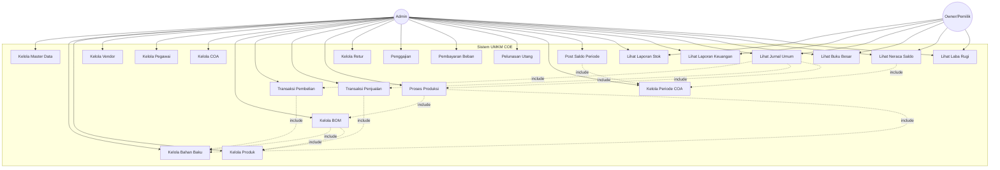

# Use Case Diagram - Sistem UMKM COE

## Use Case Diagram Lengkap

## Deskripsi Use Case

### Aktor

| Aktor | Deskripsi |
|-------|-----------|
| **Admin** | Pengguna yang mengelola seluruh operasional sistem termasuk master data, transaksi, dan laporan |
| **Owner/Pemilik** | Pemilik usaha yang dapat melihat laporan dan monitoring bisnis |

### Use Case Utama

| No | Use Case | Deskripsi | Aktor |
|----|----------|-----------|-------|
| 1 | Kelola Master Data | Mengelola data master seperti satuan, jabatan, kategori | Admin |
| 2 | Kelola Bahan Baku | CRUD bahan baku, update stok, harga | Admin |
| 3 | Kelola Produk | CRUD produk, set harga jual, BTKL, BOP | Admin |
| 4 | Kelola Vendor | CRUD vendor/supplier | Admin |
| 5 | Kelola Pegawai | CRUD pegawai, set gaji, jabatan | Admin |
| 6 | Kelola COA | CRUD Chart of Accounts | Admin |
| 7 | Kelola BOM | Buat dan kelola Bill of Material | Admin |
| 8 | Transaksi Pembelian | Input pembelian bahan baku | Admin |
| 9 | Transaksi Penjualan | Input penjualan produk | Admin |
| 10 | Proses Produksi | Input produksi, konsumsi bahan, hitung HPP | Admin |
| 11 | Kelola Retur | Input retur pembelian/penjualan | Admin |
| 12 | Penggajian | Proses penggajian pegawai | Admin |
| 13 | Pembayaran Beban | Input pembayaran beban operasional | Admin |
| 14 | Pelunasan Utang | Pelunasan utang pembelian | Admin |
| 15 | Lihat Laporan Stok | Melihat laporan stok bahan & produk | Admin, Owner |
| 16 | Lihat Laporan Keuangan | Melihat laporan keuangan lengkap | Admin, Owner |
| 17 | Lihat Jurnal Umum | Melihat jurnal umum transaksi | Admin, Owner |
| 18 | Lihat Buku Besar | Melihat buku besar per akun | Admin, Owner |
| 19 | Lihat Neraca Saldo | Melihat neraca saldo per periode | Admin, Owner |
| 20 | Lihat Laba Rugi | Melihat laporan laba rugi | Admin, Owner |
| 21 | Kelola Periode COA | Buat dan kelola periode bulanan | Admin |
| 22 | Post Saldo Periode | Posting saldo akhir ke periode berikutnya | Admin |

### Relasi Use Case

| Relasi | Use Case Sumber | Use Case Target | Jenis |
|--------|----------------|-----------------|-------|
| 1 | Kelola BOM | Kelola Bahan Baku | Include |
| 2 | Kelola BOM | Kelola Produk | Include |
| 3 | Proses Produksi | Kelola BOM | Include |
| 4 | Proses Produksi | Kelola Bahan Baku | Include |
| 5 | Transaksi Pembelian | Kelola Bahan Baku | Include |
| 6 | Transaksi Penjualan | Kelola Produk | Include |
| 7 | Lihat Jurnal Umum | Transaksi Pembelian | Include |
| 8 | Lihat Jurnal Umum | Transaksi Penjualan | Include |
| 9 | Lihat Jurnal Umum | Proses Produksi | Include |
| 10 | Lihat Neraca Saldo | Kelola Periode COA | Include |
| 11 | Post Saldo Periode | Kelola Periode COA | Include |

---

## Skenario Use Case Detail

### UC-10: Proses Produksi

**Aktor Utama:** Admin

**Tujuan:** Mencatat proses produksi dan menghitung HPP

**Prasyarat:**
- Admin sudah login
- Produk sudah memiliki BOM
- Stok bahan baku mencukupi

**Skenario Utama:**
1. Admin memilih menu Transaksi > Produksi
2. Sistem menampilkan form input produksi
3. Admin memilih produk yang akan diproduksi
4. Admin memasukkan tanggal dan qty produksi
5. Sistem validasi BOM dan stok bahan
6. Sistem menghitung kebutuhan bahan
7. Sistem consume stok bahan (FIFO)
8. Sistem hitung total biaya (Bahan + BTKL + BOP)
9. Sistem tambah stok produk jadi
10. Sistem posting 3 jurnal akuntansi
11. Sistem tampilkan detail produksi

**Skenario Alternatif:**
- 5a. BOM belum ada → Sistem tampilkan error
- 5b. Stok bahan tidak cukup → Sistem tampilkan bahan yang kurang

**Post-condition:**
- Data produksi tersimpan
- Stok bahan berkurang
- Stok produk bertambah
- Jurnal akuntansi terposting

---

### UC-22: Post Saldo Periode

**Aktor Utama:** Admin

**Tujuan:** Menutup periode dan posting saldo ke periode berikutnya

**Prasyarat:**
- Admin sudah login
- Periode belum ditutup
- Semua transaksi sudah dicatat

**Skenario Utama:**
1. Admin memilih menu Akuntansi > Neraca Saldo
2. Sistem menampilkan neraca saldo periode aktif
3. Admin memilih periode yang akan ditutup
4. Admin klik tombol "Post Saldo Akhir"
5. Sistem konfirmasi posting
6. Admin konfirmasi
7. Sistem hitung saldo akhir semua akun
8. Sistem simpan saldo akhir
9. Sistem buat saldo awal periode berikutnya
10. Sistem tandai periode sebagai ditutup
11. Sistem tampilkan pesan sukses

**Skenario Alternatif:**
- 7a. Periode sudah ditutup → Sistem tampilkan info
- 7b. Periode berikutnya sudah ditutup → Sistem tolak

**Post-condition:**
- Periode ditandai sebagai ditutup
- Saldo akhir tersimpan
- Saldo awal periode berikutnya terbuat
