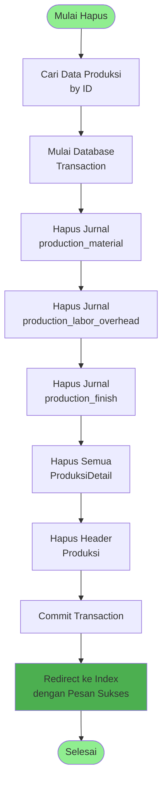
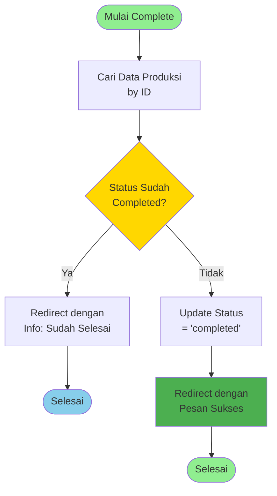
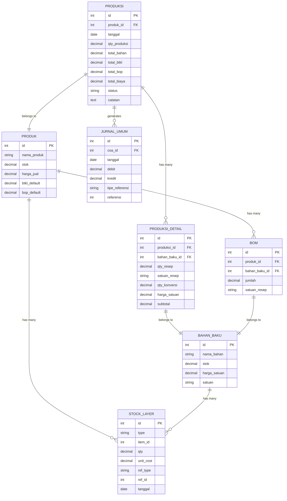
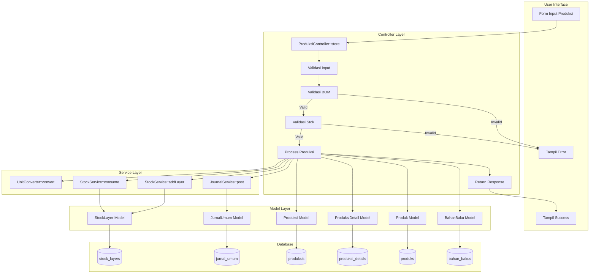
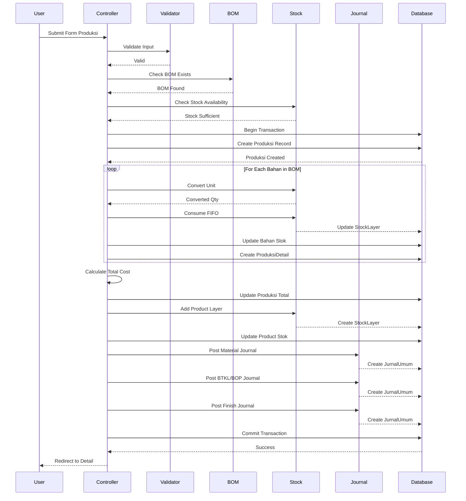
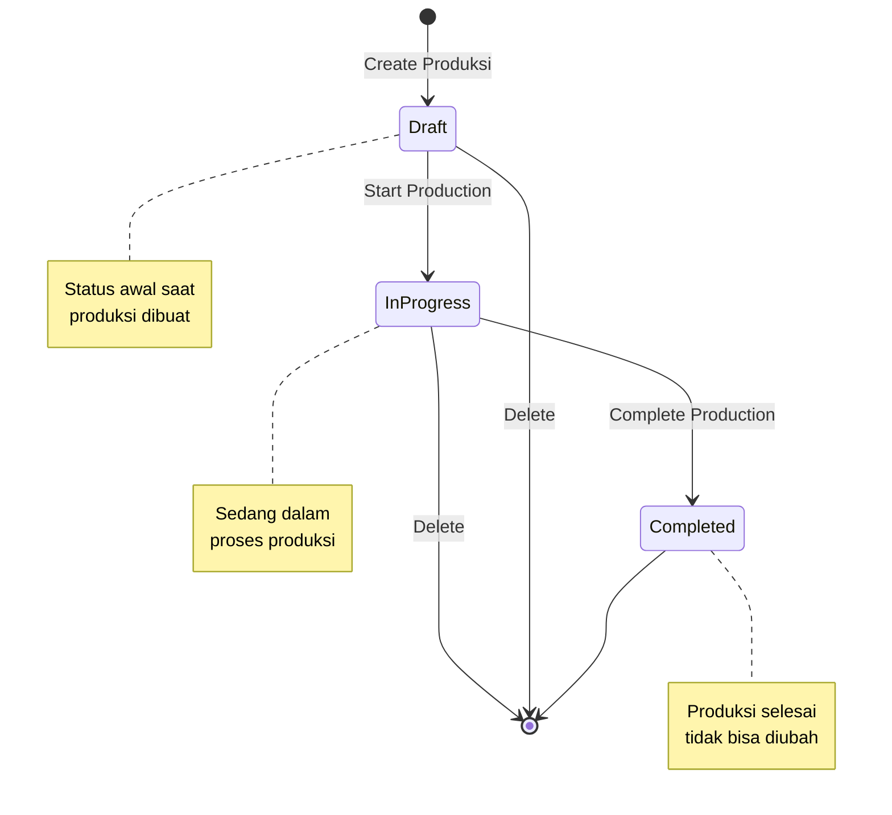

# BPMN - Proses Produksi

## Diagram BPMN Proses Produksi

```mermaid
graph TB
    Start([Mulai Produksi]) --> Input[Input Data Produksi<br/>- Pilih Produk<br/>- Tanggal<br/>- Qty Produksi]
    
    Input --> ValidateBOM{Produk Punya<br/>BOM & Detail?}
    ValidateBOM -->|Tidak| ErrorBOM[Error: BOM Belum Ada<br/>Harus Buat BOM Dulu]
    ErrorBOM --> End1([Selesai])
    
    ValidateBOM -->|Ya| GetBOM[Ambil Data BOM<br/>& Detail Bahan Baku]
    
    GetBOM --> CheckStock{Cek Stok<br/>Semua Bahan<br/>Cukup?}
    
    CheckStock -->|Tidak| ErrorStock[Error: Stok Tidak Cukup<br/>Tampilkan Bahan yang Kurang]
    ErrorStock --> End2([Selesai])
    
    CheckStock -->|Ya| StartTrans[Mulai Database<br/>Transaction]
    
    StartTrans --> CreateProduksi[Buat Record Produksi<br/>- produk_id<br/>- tanggal<br/>- qty_produksi]
    
    CreateProduksi --> LoopBahan[Loop Setiap Bahan<br/>di BOM]
    
    LoopBahan --> ConvertUnit[Konversi Satuan<br/>Resep ke Satuan Base]
    
    ConvertUnit --> ConsumeFIFO[Consume Stock FIFO<br/>- Kurangi StockLayer<br/>- Hitung FIFO Cost]
    
    ConsumeFIFO --> UpdateStokBahan[Update Stok<br/>Bahan Baku Master]
    
    UpdateStokBahan --> CreateDetail[Buat ProduksiDetail<br/>- bahan_baku_id<br/>- qty_resep<br/>- qty_konversi<br/>- harga_satuan<br/>- subtotal]
    
    CreateDetail --> NextBahan{Ada Bahan<br/>Lagi?}
    NextBahan -->|Ya| LoopBahan
    
    NextBahan -->|Tidak| HitungBiaya[Hitung Total Biaya<br/>- Total Bahan<br/>- BTKL 20%<br/>- BOP 10%<br/>- Total Biaya]
    
    HitungBiaya --> UpdateProduksi[Update Record Produksi<br/>dengan Total Biaya]
    
    UpdateProduksi --> HitungUnitCost[Hitung Unit Cost<br/>= Total Biaya / Qty]
    
    HitungUnitCost --> AddStockLayer[Tambah StockLayer<br/>Produk Jadi<br/>- type: product<br/>- unit_cost]
    
    AddStockLayer --> UpdateStokProduk[Update Stok<br/>Produk Master<br/>+= qty_produksi]
    
    UpdateStokProduk --> JurnalMaterial[Posting Jurnal 1<br/>Dr. WIP 1105<br/>Cr. Persediaan BB 1104<br/>Nilai: FIFO Cost]
    
    JurnalMaterial --> JurnalBTKLBOP[Posting Jurnal 2<br/>Dr. WIP 1105<br/>Cr. Hutang Gaji 2103<br/>Cr. Hutang BOP 2104]
    
    JurnalBTKLBOP --> JurnalFinish[Posting Jurnal 3<br/>Dr. Persediaan BJ 1107<br/>Cr. WIP 1105<br/>Nilai: Total Biaya]
    
    JurnalFinish --> Commit[Commit Transaction]
    
    Commit --> Success[Redirect ke Detail<br/>Produksi dengan<br/>Pesan Sukses]
    
    Success --> End3([Selesai])
    
    style Start fill:#90EE90
    style End1 fill:#FFB6C1
    style End2 fill:#FFB6C1
    style End3 fill:#90EE90
    style ErrorBOM fill:#FF6B6B
    style ErrorStock fill:#FF6B6B
    style Success fill:#4CAF50
    style ValidateBOM fill:#FFD700
    style CheckStock fill:#FFD700
    style NextBahan fill:#FFD700
```

## Diagram BPMN Proses Hapus Produksi

## Diagram BPMN Complete Produksi

## Relasi Database Produksi

## Flow Chart Lengkap dengan Swimlane

## Sequence Diagram Proses Produksi

## State Diagram Status Produksi

---

## Penjelasan Alur Proses

### 1. Input & Validasi
- User memilih produk, tanggal, dan qty produksi
- Sistem validasi apakah produk punya BOM dan detail
- Sistem cek stok semua bahan baku cukup atau tidak

### 2. Proses Konsumsi Bahan
- Loop setiap bahan di BOM
- Konversi satuan resep ke satuan base
- Consume stock dengan metode FIFO
- Update stok bahan baku master
- Buat record detail produksi

### 3. Perhitungan Biaya
- Total Bahan = Sum(qty × harga_satuan)
- BTKL = 20% × Total Bahan (atau dari default produk)
- BOP = 10% × Total Bahan (atau dari default produk)
- Total Biaya = Total Bahan + BTKL + BOP
- Unit Cost = Total Biaya / Qty Produksi

### 4. Update Stok Produk
- Tambah StockLayer produk jadi dengan unit cost
- Update stok produk master += qty produksi

### 5. Posting Jurnal (3 Jurnal)
**Jurnal 1: Konsumsi Bahan**
- Dr. WIP (1105) = FIFO Cost
- Cr. Persediaan Bahan Baku (1104) = FIFO Cost

**Jurnal 2: BTKL & BOP**
- Dr. WIP (1105) = BTKL + BOP
- Cr. Hutang Gaji (2103) = BTKL
- Cr. Hutang BOP (2104) = BOP

**Jurnal 3: Selesai Produksi**
- Dr. Persediaan Barang Jadi (1107) = Total Biaya
- Cr. WIP (1105) = Total Biaya

### 6. Commit & Response
- Commit transaction
- Redirect ke halaman detail produksi
- Tampilkan pesan sukses

---

## Relasi Antar Entitas

### Produksi
- **Belongs To**: Produk
- **Has Many**: ProduksiDetail
- **Generates**: JurnalUmum (3 jurnal)
- **Creates**: StockLayer (produk jadi)

### ProduksiDetail
- **Belongs To**: Produksi
- **Belongs To**: BahanBaku

### Produk
- **Has Many**: Produksi
- **Has Many**: BOM
- **Has Many**: StockLayer

### BahanBaku
- **Has Many**: ProduksiDetail
- **Has Many**: BOM
- **Has Many**: StockLayer

### StockLayer
- **Polymorphic**: item (Produk atau BahanBaku)
- **Polymorphic**: ref (Produksi, Pembelian, Penjualan)

### JurnalUmum
- **Belongs To**: COA
- **Polymorphic**: referensi (Produksi, Pembelian, Penjualan, dll)

---

## Kesimpulan

Proses produksi melibatkan:
1. ✅ Validasi BOM dan stok
2. ✅ Konsumsi bahan dengan FIFO
3. ✅ Perhitungan biaya (Bahan + BTKL + BOP)
4. ✅ Update stok produk jadi
5. ✅ Posting 3 jurnal akuntansi
6. ✅ Transaction untuk integritas data

Semua proses terintegrasi dengan:
- Stock Management (FIFO)
- Accounting (Jurnal)
- BOM (Bill of Material)
- Unit Conversion
