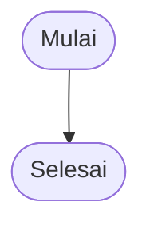

# 📖 Cara Melihat BPMN Proses Produksi

## ✅ CARA TERMUDAH (Recommended!)

### 1. Buka File HTML di Browser

**Langkah-langkah:**

1. **Cari file** `LIHAT_BPMN_PRODUKSI.html` di folder project Anda
2. **Klik kanan** pada file tersebut
3. **Pilih** "Open with" → "Chrome" atau "Firefox" atau browser apapun
4. **Selesai!** Diagram akan langsung muncul dengan tampilan cantik

**Atau:**
- Double-click file `LIHAT_BPMN_PRODUKSI.html`
- Akan otomatis terbuka di browser default Anda

**Fitur di HTML:**
- ✅ 6 diagram berbeda (klik tab untuk ganti)
- ✅ Warna-warni dan mudah dibaca
- ✅ Responsive (bisa di zoom)
- ✅ Tidak perlu install apapun
- ✅ Offline (tidak perlu internet)

---

## 🌐 Cara Lain - Pakai Website Online

### 2. Mermaid Live Editor

**Langkah-langkah:**

1. Buka website: **https://mermaid.live/**
2. Buka file `BPMN_PROSES_PRODUKSI.md`
3. Copy code yang ada di dalam blok ` ```mermaid ` (tanpa backtick)
4. Paste di website Mermaid Live
5. Diagram akan otomatis ter-render

**Contoh:**
```
Copy dari:


Paste ke: https://mermaid.live/
```

---

## 💻 Cara di VS Code (Jika Pakai VS Code)

### 3. Install Extension

**Langkah-langkah:**

1. Buka VS Code
2. Tekan `Ctrl + Shift + X` (Windows) atau `Cmd + Shift + X` (Mac)
3. Cari extension: **"Markdown Preview Mermaid Support"**
4. Klik **Install**
5. Buka file `BPMN_PROSES_PRODUKSI.md`
6. Tekan `Ctrl + Shift + V` untuk preview
7. Diagram akan muncul!

**Extension yang Recommended:**
- Markdown Preview Mermaid Support
- Mermaid Markdown Syntax Highlighting

---

## 📱 Cara di GitHub/GitLab

### 4. Upload ke Repository

**Langkah-langkah:**

1. Upload file `BPMN_PROSES_PRODUKSI.md` ke GitHub/GitLab
2. Buka file di browser
3. Diagram akan otomatis ter-render
4. GitHub dan GitLab support Mermaid secara native

---

## 🎯 Rekomendasi Saya

**Untuk Anda (User):**
→ **Pakai cara #1** (Buka file HTML di browser)
   - Paling mudah
   - Tidak perlu install apapun
   - Tampilan paling bagus
   - Bisa klik-klik tab

**Untuk Developer:**
→ **Pakai cara #3** (VS Code dengan extension)
   - Bisa edit langsung
   - Preview real-time
   - Integrated dengan workflow

**Untuk Dokumentasi Tim:**
→ **Pakai cara #4** (Upload ke GitHub)
   - Semua orang bisa akses
   - Version control
   - Mudah di-share

---

## 🆘 Troubleshooting

### Diagram tidak muncul di HTML?
- Pastikan ada koneksi internet (untuk load library Mermaid.js)
- Coba browser lain (Chrome/Firefox recommended)
- Clear cache browser

### Diagram tidak muncul di VS Code?
- Pastikan extension sudah terinstall
- Restart VS Code
- Coba buka file lagi

### Diagram error di Mermaid Live?
- Pastikan copy code yang benar (tanpa backtick)
- Cek syntax error
- Coba copy ulang

---

## 📊 Isi Diagram

File `LIHAT_BPMN_PRODUKSI.html` berisi 6 diagram:

1. **📊 Proses Utama** - Alur lengkap produksi
2. **🗑️ Hapus Produksi** - Proses delete
3. **✅ Complete** - Tandai selesai
4. **🔗 Relasi Database** - ERD tabel
5. **⏱️ Sequence** - Urutan interaksi
6. **📍 State** - Status produksi

---

## 💡 Tips

- Gunakan **Ctrl + Mouse Wheel** untuk zoom in/out
- Klik tab untuk ganti diagram
- Scroll untuk lihat diagram panjang
- Screenshot untuk dokumentasi

---

## ✅ Kesimpulan

**Cara Paling Mudah:**
```
1. Cari file: LIHAT_BPMN_PRODUKSI.html
2. Double-click
3. Selesai! 🎉
```

Semua diagram sudah siap dan cantik!
