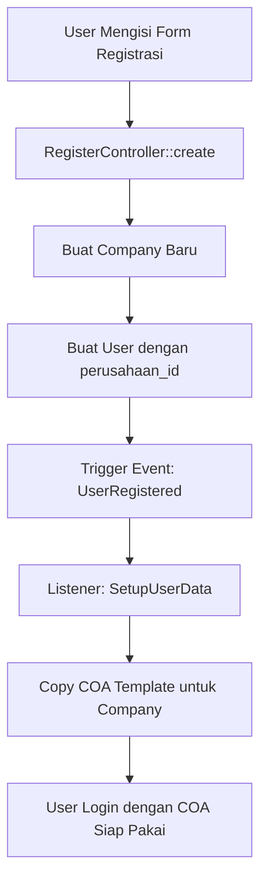

# Sistem Registrasi User Baru - Dokumentasi

## 🎯 Overview

Sistem ini dirancang agar **setiap user baru yang registrasi mendapatkan data yang bersih dan siap pakai**. Saat user baru mendaftar sebagai owner, sistem akan otomatis:

1. ✅ Membuat company baru
2. ✅ Membuat user dengan role owner
3. ✅ **Otomatis copy COA template** ke company tersebut
4. ✅ Data lain (Pegawai, Produk, dll) **KOSONG** - siap untuk diisi sesuai bisnis masing-masing

---

## 🏗️ Arsitektur Sistem

### 1. COA Template (Master)
- Disimpan di database dengan `company_id = null`
- Berisi 90+ akun COA standar
- Diisi saat `php artisan db:seed` pertama kali

### 2. Event-Driven Architecture
```
User Registrasi → Event: UserRegistered → Listener: SetupUserData → Copy COA Template
```

### 3. Flow Registrasi



---

## 📁 File-File Penting

### 1. **database/seeders/CoaTemplateSeeder.php**
- Membuat COA template (company_id = null)
- Method `copyCoaTemplateForCompany()` untuk copy COA ke company baru

### 2. **app/Events/UserRegistered.php**
- Event yang di-trigger saat user baru registrasi
- Membawa data: User dan Company ID

### 3. **app/Listeners/SetupUserData.php**
- Listener yang handle event UserRegistered
- Memanggil `CoaTemplateSeeder::copyCoaTemplateForCompany()`

### 4. **app/Http/Controllers/Auth/RegisterController.php**
- Controller registrasi
- Trigger event `UserRegistered` setelah user dibuat

### 5. **app/Providers/EventServiceProvider.php**
- Mendaftarkan event dan listener

---

## 📊 Data yang Otomatis Terisi untuk User Baru

### ✅ COA (Chart of Accounts) - 90+ Akun

| Kategori | Jumlah Akun | Contoh |
|----------|-------------|--------|
| **ASET** | 30+ | Kas Bank, Kas, Persediaan, Aset Tetap |
| **KEWAJIBAN** | 4 | Hutang Usaha, Hutang Gaji, PPN |
| **MODAL** | 3 | Modal Usaha, Prive |
| **PENDAPATAN** | 5 | Penjualan, Retur, Ongkir |
| **BIAYA** | 50+ | BBB, BTKL, BOP, BTKTL, BOP TL |

**Detail COA:**
- Kas Bank (111) - Rp 100.000.000
- Kas (112) - Rp 75.000.000
- Persediaan Bahan Baku (114-1144)
- Persediaan Bahan Pendukung (115-1157)
- Persediaan Barang Jadi (116-1162)
- Aset Tetap & Penyusutan (119-126)
- Biaya Produksi Lengkap (51-55)

### ❌ Data yang KOSONG (Siap Diisi User)

- Pegawai
- Produk
- Supplier
- Customer
- Transaksi (Pembelian, Penjualan, Produksi)
- Jurnal
- Laporan

---

## 🚀 Cara Kerja

### Setup Awal (Sekali Saja)

```bash
# 1. Clone repository
git clone <repository-url>
cd <project-folder>

# 2. Install dependencies
composer install
npm install

# 3. Setup environment
cp .env.example .env
php artisan key:generate

# 4. Konfigurasi database di .env

# 5. Jalankan migration dan seeder
php artisan migrate:fresh --seed
```

Perintah `php artisan db:seed` akan menjalankan:
1. `CoaTemplateSeeder` - Membuat COA template (company_id = null)
2. `InitialSetupSeeder` - Membuat Satuan, Jenis Aset, Kategori Aset
3. `UserSeeder` - Membuat user admin default

### Registrasi User Baru

1. **User mengakses halaman registrasi** (`/register`)
2. **User mengisi form:**
   - Nama
   - Email
   - Password
   - Nomor Telepon
   - **Data Perusahaan:**
     - Nama Perusahaan
     - Alamat
     - Email Perusahaan
     - Telepon Perusahaan

3. **Sistem otomatis:**
   - Membuat company baru dengan kode unik
   - Membuat user dengan role `owner`
   - **Trigger event `UserRegistered`**
   - **Listener copy COA template** ke company baru
   - User login dengan COA siap pakai

4. **User dapat langsung:**
   - Melihat COA yang sudah terisi
   - Menambah Pegawai
   - Menambah Produk
   - Mulai transaksi

---

## 🔧 Kustomisasi COA Template

Jika ingin mengubah COA template yang diberikan ke user baru:

### Edit File: `database/seeders/CoaTemplateSeeder.php`

```php
public function seedCoaTemplate(): void
{
    $coaTemplate = [
        // Tambah/Edit/Hapus akun di sini
        ['kode_akun' => 'XXX', 'nama_akun' => 'Nama Akun Baru', 'tipe_akun' => 'Aset', 'saldo_awal' => 0],
    ];
    
    // ...
}
```

### Jalankan Ulang Seeder

```bash
# Reset COA template
php artisan db:seed --class=CoaTemplateSeeder
```

⚠️ **PENTING**: Perubahan hanya berlaku untuk user baru yang registrasi setelah seeder dijalankan. User lama tidak terpengaruh.

---

## 🧪 Testing

### Test Manual

1. **Registrasi user baru:**
   ```
   - Buka /register
   - Isi form registrasi
   - Submit
   ```

2. **Verifikasi COA:**
   ```
   - Login sebagai user baru
   - Buka menu Master Data > COA
   - Pastikan ada 90+ akun COA
   ```

3. **Verifikasi Data Kosong:**
   ```
   - Buka menu Master Data > Pegawai (harus kosong)
   - Buka menu Master Data > Produk (harus kosong)
   - Buka menu Transaksi (harus kosong)
   ```

### Test dengan Artisan Tinker

```bash
php artisan tinker
```

```php
// Simulasi registrasi
$user = User::create([
    'name' => 'Test User',
    'email' => 'test@example.com',
    'password' => bcrypt('password'),
    'role' => 'owner',
    'perusahaan_id' => 1,
]);

// Trigger event manual
event(new \App\Events\UserRegistered($user, 1));

// Cek COA
\App\Models\Coa::where('company_id', 1)->count(); // Harus 90+
```

---

## 📝 Log & Debugging

### Cek Log

```bash
tail -f storage/logs/laravel.log
```

### Log yang Dicatat

- ✅ `Setting up COA for new user` - Saat mulai copy COA
- ✅ `COA setup completed for new user` - Saat selesai copy COA
- ❌ `Failed to setup user data` - Jika terjadi error

### Troubleshooting

#### Error: "COA template not found"
**Solusi**: Jalankan seeder template
```bash
php artisan db:seed --class=CoaTemplateSeeder
```

#### Error: "Duplicate entry for key 'kode_akun'"
**Solusi**: COA sudah ada untuk company tersebut. Ini normal jika user sudah pernah registrasi.

#### COA tidak ter-copy saat registrasi
**Solusi**: 
1. Cek log di `storage/logs/laravel.log`
2. Pastikan event terdaftar di `EventServiceProvider`
3. Clear cache: `php artisan event:clear`

---

## 🎨 Keuntungan Sistem Ini

### 1. **Multi-Tenant Ready**
- Setiap company punya COA sendiri
- Data terpisah antar company
- Tidak ada konflik data

### 2. **Flexible untuk Berbagai Bisnis**
- COA template bisa disesuaikan
- User bisa tambah/edit COA sesuai kebutuhan
- Data lain kosong, siap diisi

### 3. **Easy Onboarding**
- User baru langsung punya COA
- Tidak perlu setup manual
- Langsung bisa mulai transaksi

### 4. **Maintainable**
- COA template terpusat
- Mudah diupdate
- Event-driven architecture

---

## 📚 Referensi

### Event & Listener
- [Laravel Events Documentation](https://laravel.com/docs/events)
- [Event-Driven Architecture](https://martinfowler.com/articles/201701-event-driven.html)

### Multi-Tenancy
- [Laravel Multi-Tenancy](https://tenancyforlaravel.com/)
- [Database Design for Multi-Tenancy](https://docs.microsoft.com/en-us/azure/sql-database/saas-tenancy-app-design-patterns)

---

## 🤝 Kontribusi

Jika ingin menambah fitur atau memperbaiki bug:

1. Fork repository
2. Buat branch baru
3. Commit changes
4. Push ke branch
5. Create Pull Request

---

## 📞 Support

Jika ada pertanyaan atau masalah, silakan hubungi tim development.

**Selamat menggunakan sistem! 🎉**
