# Sequence Diagram Mermaid Format

Copy paste code ini ke draw.io atau editor Mermaid lainnya:

```mermaid
sequenceDiagram
    participant User
    participant BiayaBahanController
    participant BTKLController
    participant BOPController
    participant HPPController
    participant ProduksiController
    participant StockReportController
    participant Database
    participant StockService
    participant JournalService

    Note over User,StockService: FASE 1: SETUP MASTER DATA BIAYA

    User->>BiayaBahanController: create(produk_id)
    BiayaBahanController->>Database: Get Produk & Bahan Baku
    Database-->>BiayaBahanController: Produk & Bahan Baku data
    BiayaBahanController-->>User: Form Biaya Bahan Baku
    
    User->>BiayaBahanController: store(bahan_baku_data)
    BiayaBahanController->>Database: Save BiayaBahanBaku
    BiayaBahanController->>Database: Update HargaPokokProduksiBiayaBahanBaku
    Database-->>BiayaBahanController: Confirmation
    BiayaBahanController-->>User: Success message
    
    User->>BTKLController: create()
    BTKLController->>Database: Get Jabatan & Pegawai
    Database-->>BTKLController: Jabatan & Pegawai data
    BTKLController-->>User: Form BTKL
    
    User->>BTKLController: store(btkl_data)
    BTKLController->>Database: Save BTKL
    BTKLController->>Database: Create ProsesProduksi
    BTKLController->>StockService: syncBomFromMaterialChange()
    Database-->>BTKLController: Confirmation
    BTKLController-->>User: Success message
    
    User->>BOPController: createProses()
    BOPController->>Database: Get ProsesProduksi & COA
    Database-->>BOPController: Process & COA data
    BOPController-->>User: Form BOP Proses
    
    User->>BOPController: storeProses(bop_data)
    BOPController->>Database: Save BOP Proses
    BOPController->>Database: Calculate total_bop_per_produk
    Database-->>BOPController: Confirmation
    BOPController-->>User: Success message

    Note over User,JournalService: FASE 2: KALKULASI HPP

    User->>HPPController: create(produk_id)
    HPPController->>Database: Get Produk, BBB, BTKL, BOP
    Database-->>HPPController: Cost components data
    HPPController-->>User: Form HPP Calculation
    
    User->>HPPController: store(hpp_data)
    HPPController->>Database: Create BomJobCosting
    HPPController->>Database: Calculate total BBB
    HPPController->>Database: Calculate total BTKL
    HPPController->>Database: Calculate total BOP
    HPPController->>Database: Calculate total HPP
    HPPController->>Database: Update Produk.harga_pokok
    Database-->>HPPController: HPP calculated
    HPPController-->>User: HPP Result

    Note over User,StockService: FASE 3: PROSES PRODUKSI

    User->>ProduksiController: create()
    ProduksiController->>Database: Get Produk with HPP data
    Database-->>ProduksiController: Produk list
    ProduksiController-->>User: Form Produksi
    
    User->>ProduksiController: store(produksi_data)
    ProduksiController->>Database: Validate HPP exists
    ProduksiController->>Database: Create Produksi record
    ProduksiController->>StockService: decreaseStock(materials)
    StockService->>Database: Create StockMovement (OUT)
    StockService->>Database: Update StockLayer
    StockService-->>ProduksiController: Stock updated
    ProduksiController->>JournalService: createProductionJournal()
    JournalService->>Database: Create Journal entries
    JournalService-->>ProduksiController: Journal created
    ProduksiController->>StockService: increaseStock(products)
    StockService->>Database: Create StockMovement (IN)
    StockService->>Database: Update StockLayer
    StockService-->>ProduksiController: Stock updated
    Database-->>ProduksiController: Production complete
    ProduksiController-->>User: Success message

    Note over User,StockService: FASE 4: MONITORING & LAPORAN

    User->>StockReportController: index()
    StockReportController->>StockService: getStockReport()
    StockService->>Database: Calculate current stock
    StockService->>Database: Get stock movements
    StockService-->>StockReportController: Stock data
    StockReportController->>StockReportController: getStockSummary()
    StockReportController-->>User: Stock Report Dashboard
    
    User->>StockReportController: movements(item_type, item_id)
    StockReportController->>Database: Get item details
    StockReportController->>Database: Get StockMovement history
    StockReportController->>StockService: getCurrentStock()
    StockService-->>StockReportController: Current stock
    StockReportController->>StockReportController: Calculate running balance
    StockReportController-->>User: Stock Movement Report
    
    User->>StockReportController: apiStockData()
    StockReportController->>StockService: getCurrentStock()
    StockService->>Database: Real-time stock calculation
    StockService-->>StockReportController: Stock data
    StockReportController-->>User: JSON Response

    Note over User,JournalService: FASE 5: REKALKULASI & SYNC

    User->>HPPController: recalculate(produk_id)
    HPPController->>Database: Get BomJobCosting
    HPPController->>Database: Recalculate BBB
    HPPController->>Database: Recalculate BTKL
    HPPController->>Database: Recalculate BOP
    HPPController->>Database: Update total HPP
    HPPController->>Database: Update Produk.harga_pokok
    Database-->>HPPController: HPP updated
    HPPController-->>User: Recalculation complete
    
    User->>StockReportController: syncStock(item_type, item_id)
    StockReportController->>StockService: getCurrentStock()
    StockService->>Database: Calculate real-time stock
    StockService-->>StockReportController: Stock quantity
    StockReportController->>Database: Update model stock
    Database-->>StockReportController: Stock synced
    StockReportController-->>User: Sync confirmation
```

## Cara Menggunakan di draw.io:

### **Cara 1: Import Mermaid**
1. **Buka draw.io**
2. **File → Import → Text**
3. **Copy paste** code Mermaid di atas
4. **Pilih "Mermaid"** sebagai format
5. **Klik "Import"**

### **Cara 2: Online Mermaid Editor**
1. **Buka** https://mermaid.live/
2. **Copy paste** code di atas
3. **Klik "Render"**

### **Cara 3: VS Code Extension**
1. **Install** Mermaid Preview extension
2. **Copy paste** code ke file .md
3. **Preview** dengan extension

## Alternatif: XML Per Fase

Saya juga sudah buat file XML per fase:
- `FASE1_SETUP_MASTER_DATA.xml` - Setup Master Data Biaya
- Bisa ditambah fase lainnya jika diperlukan

## Keuntungan Format Mermaid:
- **Auto-layout** - Tidak perlu atur posisi manual
- **Responsive** - Otomatis menyesuaikan ukuran
- **Text-based** - Mudah diedit dan version control
- **Exportable** - Bisa export ke PNG, SVG, PDF
