# Sequence Diagram - Sistem Manajemen Biaya Produksi

## Overview
Sequence diagram menggambarkan aliran data dan interaksi antar modul dalam sistem manajemen biaya produksi UMKM_COE.

## Modules Involved
1. **Biaya Bahan Baku** - Manajemen biaya material baku
2. **BTKL (Biaya Tenaga Kerja Langsung)** - Manajemen biaya tenaga kerja langsung
3. **BOP (Biaya Overhead Pabrik)** - Manajemen biaya overhead produksi
4. **Harga Pokok Produksi (HPP)** - Kalkulasi harga pokok produksi
5. **Produksi** - Manajemen proses produksi
6. **Laporan Stok** - Pelaporan real-time stock

## Sequence Diagram

```mermaid
sequenceDiagram
    participant User
    participant BiayaBahanController
    participant BtklController
    participant BopController
    participant HppController
    participant ProduksiController
    participant StockReportController
    participant Database
    participant StockService
    participant JournalService

    Note over User,StockService: FASE 1: SETUP MASTER DATA BIAYA

    User->>BiayaBahanController: create(produk_id)
    BiayaBahanController->>Database: Get Produk & Bahan Baku
    Database-->>BiayaBahanController: Produk & Bahan Baku data
    BiayaBahanController-->>User: Form Biaya Bahan Baku
    
    User->>BiayaBahanController: store(bahan_baku_data)
    BiayaBahanController->>Database: Save BiayaBahanBaku
    BiayaBahanController->>Database: Update HargaPokokProduksiBiayaBahanBaku
    Database-->>BiayaBahanController: Confirmation
    BiayaBahanController-->>User: Success message
    
    User->>BtklController: create()
    BtklController->>Database: Get Jabatan & Pegawai
    Database-->>BtklController: Jabatan & Pegawai data
    BtklController-->>User: Form BTKL
    
    User->>BtklController: store(btkl_data)
    BtklController->>Database: Save BTKL
    BtklController->>Database: Create ProsesProduksi
    BtklController->>StockService: syncBomFromMaterialChange()
    Database-->>BtklController: Confirmation
    BtklController-->>User: Success message
    
    User->>BopController: createProses()
    BopController->>Database: Get ProsesProduksi & COA
    Database-->>BopController: Process & COA data
    BopController-->>User: Form BOP Proses
    
    User->>BopController: storeProses(bop_data)
    BopController->>Database: Save BOP Proses
    BopController->>Database: Calculate total_bop_per_produk
    Database-->>BopController: Confirmation
    BopController-->>User: Success message

    Note over User,JournalService: FASE 2: KALKULASI HPP

    User->>HppController: create(produk_id)
    HppController->>Database: Get Produk, BBB, BTKL, BOP
    Database-->>HppController: Cost components data
    HppController-->>User: Form HPP Calculation
    
    User->>HppController: store(hpp_data)
    HppController->>Database: Create BomJobCosting
    HppController->>Database: Calculate total BBB
    HppController->>Database: Calculate total BTKL
    HppController->>Database: Calculate total BOP
    HppController->>Database: Calculate total HPP
    HppController->>Database: Update Produk.harga_pokok
    Database-->>HppController: HPP calculated
    HppController-->>User: HPP Result

    Note over User,StockService: FASE 3: PROSES PRODUKSI

    User->>ProduksiController: create()
    ProduksiController->>Database: Get Produk with HPP data
    Database-->>ProduksiController: Produk list
    ProduksiController-->>User: Form Produksi
    
    User->>ProduksiController: store(produksi_data)
    ProduksiController->>Database: Validate HPP exists
    ProduksiController->>Database: Create Produksi record
    ProduksiController->>StockService: decreaseStock(materials)
    StockService->>Database: Create StockMovement (OUT)
    StockService->>Database: Update StockLayer
    StockService-->>ProduksiController: Stock updated
    ProduksiController->>JournalService: createProductionJournal()
    JournalService->>Database: Create Journal entries
    JournalService-->>ProduksiController: Journal created
    ProduksiController->>StockService: increaseStock(products)
    StockService->>Database: Create StockMovement (IN)
    StockService->>Database: Update StockLayer
    StockService-->>ProduksiController: Stock updated
    Database-->>ProduksiController: Production complete
    ProduksiController-->>User: Success message

    Note over User,StockService: FASE 4: MONITORING & LAPORAN

    User->>StockReportController: index()
    StockReportController->>StockService: getStockReport()
    StockService->>Database: Calculate current stock
    StockService->>Database: Get stock movements
    StockService-->>StockReportController: Stock data
    StockReportController->>StockReportController: getStockSummary()
    StockReportController-->>User: Stock Report Dashboard
    
    User->>StockReportController: movements(item_type, item_id)
    StockReportController->>Database: Get item details
    StockReportController->>Database: Get StockMovement history
    StockReportController->>StockService: getCurrentStock()
    StockService-->>StockReportController: Current stock
    StockReportController->>StockReportController: Calculate running balance
    StockReportController-->>User: Stock Movement Report
    
    User->>StockReportController: apiStockData()
    StockReportController->>StockService: getCurrentStock()
    StockService->>Database: Real-time stock calculation
    StockService-->>StockReportController: Stock data
    StockReportController-->>User: JSON Response

    Note over User,JournalService: FASE 5: REKALKULASI & SYNC

    User->>HppController: recalculate(produk_id)
    HppController->>Database: Get BomJobCosting
    HppController->>Database: Recalculate BBB
    HppController->>Database: Recalculate BTKL
    HppController->>Database: Recalculate BOP
    HppController->>Database: Update total HPP
    HppController->>Database: Update Produk.harga_pokok
    Database-->>HppController: HPP updated
    HppController-->>User: Recalculation complete
    
    User->>StockReportController: syncStock(item_type, item_id)
    StockReportController->>StockService: getCurrentStock()
    StockService->>Database: Calculate real-time stock
    StockService-->>StockReportController: Stock quantity
    StockReportController->>Database: Update model stock
    Database-->>StockReportController: Stock synced
    StockReportController-->>User: Sync confirmation
```

## Data Flow Analysis

### 1. Master Data Setup Flow
- **Biaya Bahan Baku**: Setup material costs per product
- **BTKL**: Setup labor costs with capacity calculations
- **BOP**: Setup overhead costs per production process

### 2. HPP Calculation Flow
- Aggregate all cost components (BBB + BTKL + BOP)
- Calculate total production cost
- Update product's cost basis

### 3. Production Execution Flow
- Validate HPP exists before production
- Decrease raw material stock
- Create production journal entries
- Increase finished goods stock

### 4. Stock Monitoring Flow
- Real-time stock calculation
- Stock movement tracking
- Stock status reporting (aman/menipis/habis)

### 5. Reconciliation Flow
- HPP recalculation based on latest costs
- Stock synchronization between layers and models

## Key Integration Points

### Database Tables Involved
- `biaya_bahan_bakus` - Material cost data
- `btkls` - Labor cost data
- `bop_proses` - Overhead cost data
- `bom_job_costings` - HPP calculations
- `produksis` - Production records
- `stock_movements` - Stock transaction logs
- `stock_layers` - FIFO stock layers

### Service Classes
- `StockService` - Real-time stock management
- `JournalService` - Accounting journal creation
- `BomSyncService` - BOM synchronization

### Validation Rules
- Multi-tenant isolation (user_id filtering)
- HPP must exist before production
- Stock validation for production quantities
- Cost component validation

## Error Handling & Edge Cases
- Insufficient stock during production
- Missing HPP data
- Stock synchronization failures
- Multi-tenant data isolation

## Performance Considerations
- Real-time stock calculations
- FIFO layer management
- Large dataset reporting
- Concurrent production transactions
